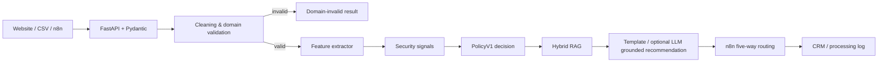

# AI Sales Lead CRM Automation

[中文](README.md) · [English](README.en.md)

[](https://github.com/jorlin1101-cyber/ai-sales-lead-crm-automation/actions/workflows/ci.yml)


[](LICENSE)

A testable, explainable, offline-friendly sales lead processing service. It validates and
cleans incoming leads, extracts constrained business features, applies deterministic scoring,
retrieves grounded knowledge, and hands stable results to n8n for CRM routing.


## Contents

- [Problem](#problem)
- [Tech stack](#tech-stack)
- [Highlights](#highlights)
- [Architecture](#architecture)
- [Repository layout](#repository-layout)
- [Quick start](#quick-start)
- [Docker deployment](#docker-deployment)
- [Offline interview CLI](#offline-interview-cli)
- [API example](#api-example)
- [Execution modes](#execution-modes)
- [RAG and evaluation](#rag-and-evaluation)
- [Optional grounded LLM recommendation](#optional-grounded-llm-recommendation)
- [n8n workflow](#n8n-workflow)
- [Quality gate](#quality-gate)
- [Five-minute interview walkthrough](#five-minute-interview-walkthrough)
- [Roadmap](#roadmap)
- [Documentation, contributing, and license](#documentation-contributing-and-license)

## Problem

Leads arriving from forms, CSV files, and automation workflows often have inconsistent fields,
poor data quality, spam, or prompt-injection content. Allowing an LLM to assign the final score
also creates unstable results that are difficult to audit.

This project separates responsibilities:

- FastAPI and Pydantic own the public contract.
- Rules or an LLM extract constrained facts only.
- Versioned `PolicyV1` owns the score and disposition.
- RAG grounds recommendations but cannot change the lead decision.
- n8n handles orchestration, routing, and downstream connectors.

## Tech stack

| Layer | Stack |
| --- | --- |
| API and contracts | FastAPI, Pydantic v2, pydantic-settings |
| Feature extraction | deterministic rules, OpenAI Structured Outputs |
| Decision engine | versioned `PolicyV1` with auditable score breakdown |
| RAG | BM25, BGE-M3 / local keyword dense retrieval, RRF |
| Automation | n8n five-way routing |
| Quality | pytest, pytest-socket, Ruff, Mypy, coverage |
| Delivery | GitHub Actions, editable Python package |

## Highlights

- Strict `RawLeadInput → CleanedLead → LeadProcessingResult` contracts.
- Separate HTTP transport errors from HTTP 200 domain-invalid leads.
- Reproducible `demo`, `rule_only`, and `live` execution modes.
- Explicit rule fallback for approved model failures only.
- Deterministic spam, prompt-injection, and conflict handling.
- Auditable 100-point `PolicyV1` with component-level reason codes.
- Keyword RRF and BGE-M3 RRF hybrid retrieval backends.
- Optional bilingual LLM recommendations whose citations must belong to the retrieved Top 3.
- Sanitized Top 3 sources in the public API.
- Request correlation, safe structured logs, network-isolated tests, and offline CI.
- Importable n8n High / Medium / Low / Invalid / API Error workflow.

## Architecture



The central boundary is:

```text
Lead features + security signals -> PolicyV1 freezes LeadDecision
RAG runs afterwards -> RAG cannot change score, intent, or disposition
```

## Repository layout

```text
.
├── src/lead_cleaner/
│   ├── api/                 # FastAPI, error mapping, request IDs
│   ├── rag/                 # BM25, dense retrieval, RRF
│   ├── schemas/             # public Pydantic contracts
│   └── services/            # cleaning, extraction, PolicyV1, fallback
├── scripts/                 # CLI, evaluation, offline smoke
├── tests/                   # unit, integration, security, network policy
├── data/                    # sanitized demo data, snapshot, labels
├── n8n/                     # sanitized importable workflow
├── reports/                 # frozen evaluation evidence
├── docs/                    # current technical documentation
├── .github/workflows/       # offline quality gate
└── pyproject.toml
```

## Quick start

Python 3.12+ is required. CI uses Python 3.12; the project has also been accepted locally on
Python 3.14.

```bash
git clone https://github.com/jorlin1101-cyber/ai-sales-lead-crm-automation.git
cd ai-sales-lead-crm-automation
```

```powershell
# Windows
py -3.12 -m venv .venv
.\.venv\Scripts\Activate.ps1
```

```bash
# macOS / Linux
python3.12 -m venv .venv
source .venv/bin/activate
```

After activating the virtual environment, run:

```powershell
python -m pip install --upgrade pip
python -m pip install -e ".[dev]"
```

The defaults are offline-safe:

```text
APP_MODE=demo
ALLOW_NETWORK=false
RAG_BACKEND=keyword_rrf
```

Start the API:

```powershell
python -m uvicorn lead_cleaner.api.main:app --host 127.0.0.1 --port 8000
```

- Health: <http://127.0.0.1:8000/health>
- Swagger: <http://127.0.0.1:8000/docs>

## Docker deployment

Docker Desktop must be installed and running. For the first deployment, create a local
environment file:

```powershell
# Windows
Copy-Item .env.example .env
```

```bash
# macOS / Linux
cp .env.example .env
```

Build and start FastAPI in the background:

```powershell
docker compose up --build -d
```

Check the container and health endpoint:

```powershell
docker compose ps
Invoke-RestMethod http://127.0.0.1:8000/health
```

On macOS or Linux, use:

```bash
docker compose ps
curl http://127.0.0.1:8000/health
```

Default endpoints:

- Health: <http://127.0.0.1:8000/health>
- Swagger: <http://127.0.0.1:8000/docs>

If host port 8000 is already in use, change the local `.env` file:

```text
API_PORT=8080
```

The endpoints then use `http://127.0.0.1:8080`; the container still listens on port 8000
internally.

View logs or stop the service:

```powershell
docker compose logs --tail 100 api
docker compose down
```

The current Compose configuration deploys FastAPI only. n8n and the optional BGE service must
still be run separately.

## Offline interview CLI

The CLI requires no provider key, external network, or running API process.

```powershell
python -m scripts.demo_cli list
python -m scripts.demo_cli process --scenario high
python -m scripts.demo_cli process --scenario injection
python -m scripts.demo_cli process --scenario model-failure
python -m scripts.demo_cli rag --query "What affects a private tour quotation?"
```

Scenarios:

```text
high | medium | low | invalid | injection | spam | model-failure
```

`model-failure` raises a local simulated timeout to demonstrate the explicit fallback path. It
does not call a model.

## API example

```powershell
$body = @{
    external_lead_id = "demo-high-001"
    name = "Demo High Lead"
    email = "high@example.com"
    company_name = "Example Travel Agency"
    message = "Please quote a private Chengdu tour for 20 travelers in September."
    source = "README"
} | ConvertTo-Json

Invoke-RestMethod `
    -Method Post `
    -Uri "http://127.0.0.1:8000/process-lead" `
    -ContentType "application/json" `
    -Body $body
```

The response contains `cleaned_lead`, `validation_result`, `analysis_result`, and up to three
sanitized `sources`.

- [Current API contract](docs/api-contract.md)
- [Full request and response example](docs/api-example.md)

## Execution modes

| `APP_MODE` | Feature source | External network |
| --- | --- | ---: |
| `demo` | versioned local fixtures | No |
| `rule_only` | deterministic `RuleFeatureExtractor` | No |
| `live` | OpenAI feature extraction with approved fallback | Yes |

Live mode requires `ALLOW_NETWORK=true`, a provider key, and a model name. The model returns
`ExtractedLeadFeatures`; `PolicyV1` still calculates the final score.

## RAG and evaluation

| `RAG_BACKEND` | Implementation | Network |
| --- | --- | ---: |
| `disabled` | no retrieval | No |
| `keyword_rrf` | BM25 + local keyword dense + RRF | No |
| `bge_rrf` | BM25 + BGE-M3 dense + RRF | Yes |

The frozen configuration contains 47 knowledge chunks, 18 manually curated queries,
BM25 + BGE-M3 dense retrieval + RRF, `top_k=3`, and 103 paired title/section judgments.

Under this configuration, `Raw + RetrievalIntent fusion` achieved:

- Direct Top 1: 18/18
- Direct Top 3: 18/18
- MRR@3: 1.0000

These metrics come from a saved BGE-M3 ranking run; they do not mean the offline CLI executes
BGE on every invocation.

See [RAG evaluation](docs/rag-evaluation.md) for the full metrics and evidence boundary.

## Optional grounded LLM recommendation

By default, the service keeps using deterministic templates and makes no additional model call:

```text
GROUNDED_RECOMMENDATION_ENABLED=false
RECOMMENDATION_MAX_OUTPUT_TOKENS=1024
```

When enabled, the model still cannot score a lead or alter `PolicyV1`. Generation runs only when:

- `APP_MODE=live`, `ALLOW_NETWORK=true`, and `LLM_PROVIDER=openai`;
- the lead is `qualified` and does not require review;
- neither lead nor knowledge injection is suspected;
- `keyword_rrf` or `bge_rrf` returns at least one real knowledge chunk.

Equivalent English and Simplified Chinese system prompts use OpenAI Structured Outputs to draft
from the lead, frozen policy result, and retrieved evidence only. The returned one to three
`cited_chunk_ids` must pass an exact Top 3 citation whitelist. Timeouts, rate limits, refusals,
incomplete output, schema errors, and invented citations safely fall back to the existing
`generic_template`.

This feature creates a human-reviewed draft only. It does not send email, call a CRM, or change
the score, intent, or disposition. The public API fields remain unchanged. See
[Grounded recommendation](docs/grounded-recommendation.md) for the full design, configuration,
and evaluation boundary.

## n8n workflow

Import [n8n/ai-sales-lead-routing.json](n8n/ai-sales-lead-routing.json) to demonstrate:

```text
High | Medium | Low | Invalid | API Error
```

The public workflow contains no credentials. CRM and Processing Log nodes are placeholders.
When n8n runs in Docker and FastAPI runs on the Windows host, use
`http://host.docker.internal:8000/process-lead`.

See [n8n workflow](docs/n8n-workflow.md).

## Quality gate

Latest complete local acceptance:

| Check | Result |
| --- | ---: |
| pytest | 577 passed |
| coverage | 95% |
| Ruff lint | passed |
| Ruff format | 145 files formatted |
| Mypy | passed |
| external socket policy | blocked by default |

```powershell
python -m ruff check .
python -m ruff format --check .
python -m mypy src
python -m pytest -q
python scripts/ci_offline_smoke.py
```

CI does not read provider keys and blocks external sockets by default.

## Five-minute interview walkthrough

```text
0:00-0:40  Explain the problem, LLM boundary, and PolicyV1
0:40-1:20  Run `list` and `high`
1:20-2:00  Run `invalid`
2:00-2:40  Run `injection` or `spam`
2:40-3:20  Run `model-failure`, show timeout fallback
3:20-4:00  Run `rag`, show local Top 3
4:00-4:35  Show n8n five-way routing
4:35-5:00  Show CI, 577 tests, 95% coverage, and known limitations
```

## Roadmap

- Expand the current FastAPI container deployment into a complete Compose stack with n8n and an
  optional local BGE service.
- Add real CRM and Processing Log connectors with idempotent writes.
- Separate tenant configuration from versioned policy configuration.
- Expand the RAG labels with hard negatives and continuous regression evaluation.
- Add policy A/B tests, human-review feedback, and calibration reports.
- Add production tracing, metrics, alerts, and sensitive-field governance.
- Define production SLOs, capacity targets, and disaster recovery.

The roadmap describes planned work, not deployed capabilities.

## Documentation, contributing, and license

- [Documentation index](docs/README.md)
- [Changelog](CHANGELOG.md)
- [Contributing guide](CONTRIBUTING.md)
- [MIT License](LICENSE)

Superseded design notes and development reviews are kept under `docs/archive/` and are not
used as the current contract.
