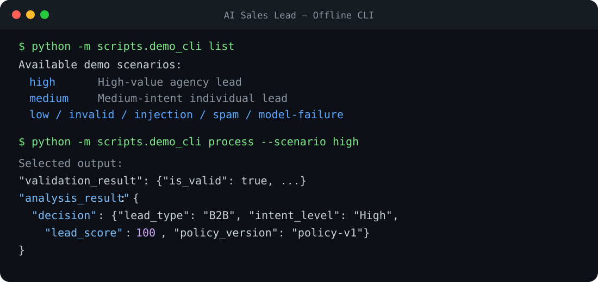
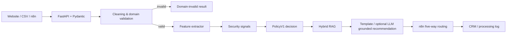

# AI Sales Lead CRM Automation

[中文](README.md) · [English](README.en.md)

[](https://github.com/jorlin1101-cyber/ai-sales-lead-crm-automation/actions/workflows/ci.yml)


[](LICENSE)

一个可测试、可解释、可离线演示的销售线索处理服务：它把外部 lead 清洗成严格契约，
提取受限业务特征，使用确定性策略评分，通过混合 RAG 提供有来源的跟进建议，再交给
n8n 路由到 CRM。



## 目录

- [项目背景](#项目背景)
- [技术栈](#技术栈)
- [核心能力](#核心能力)
- [系统架构](#系统架构)
- [项目结构](#项目结构)
- [快速开始](#快速开始)
- [Docker 一键部署](#docker-一键部署)
- [离线 CLI](#离线-cli)
- [API 示例](#api-示例)
- [运行模式](#运行模式)
- [RAG 与评测](#rag-与评测)
- [可选的有依据 LLM 推荐](#可选的有依据-llm-推荐)
- [n8n 工作流](#n8n-工作流)
- [质量门禁](#质量门禁)
- [Roadmap](#roadmap)
- [文档、贡献与许可](#文档贡献与许可)

## 项目背景

网站表单、CSV 和自动化工作流中的销售线索经常字段不一致、质量不稳定，也可能包含
垃圾推广或 Prompt 注入。让 LLM 直接决定分数又会造成结果漂移和审计困难。

本项目把职责拆开：

- FastAPI + Pydantic 管理输入和输出契约；
- LLM 或规则只提取受限事实，不直接决定分数；
- `PolicyV1` 负责稳定、可追溯的评分和处置；
- RAG 只为建议提供知识依据，不能修改销售决策；
- n8n 只负责调用、分流和连接下游 CRM。

## 技术栈

| Layer | Stack |
| --- | --- |
| API & contracts | FastAPI, Pydantic v2, pydantic-settings |
| Feature extraction | deterministic rules, OpenAI Structured Outputs |
| Decision engine | versioned `PolicyV1` with auditable score breakdown |
| RAG | BM25, BGE-M3 / local keyword dense retrieval, RRF |
| Automation | n8n five-way routing |
| Quality | pytest, pytest-socket, Ruff, Mypy, coverage |
| Delivery | GitHub Actions, editable Python package |

## 核心能力

- 严格的 `RawLeadInput → CleanedLead → LeadProcessingResult` 数据契约；
- 区分 HTTP Transport Error 和 HTTP 200 Domain-invalid Lead；
- `demo`、`rule_only`、`live` 三种可验证运行模式；
- LLM 失败时只对批准的错误执行显式规则 fallback；
- 垃圾推广、Prompt Injection 和信息冲突进入确定性安全策略；
- 100 分制 `PolicyV1`，每一分都有 component 和 reason code；
- Keyword RRF 与 BGE-M3 RRF 两种混合检索后端；
- 可选的中英文 LLM 推荐生成，引用只能来自本次检索到的 Top 3；
- API 只返回脱敏 Top 3 来源；
- request ID、安全结构化日志、网络隔离测试和离线 CI；
- 可导入的 n8n High / Medium / Low / Invalid / API Error 五路工作流。

## 系统架构



最重要的边界：

```text
Lead features + security signals -> PolicyV1 freezes LeadDecision
RAG runs afterwards -> RAG cannot change score, intent, or disposition
```

## 项目结构

```text
.
├── src/lead_cleaner/
│   ├── api/                 # FastAPI、错误映射、request ID
│   ├── rag/                 # BM25、dense retrieval、RRF
│   ├── schemas/             # Pydantic 公共契约
│   └── services/            # 清洗、特征提取、PolicyV1、fallback
├── scripts/                 # CLI、评测和离线 smoke
├── tests/                   # 单元、集成、安全与网络策略测试
├── data/                    # 脱敏 demo、知识快照、RAG 标签
├── n8n/                     # 可导入的脱敏工作流
├── reports/                 # 冻结评测证据
├── docs/                    # 当前技术文档
├── .github/workflows/       # 离线质量门禁
└── pyproject.toml
```

## 快速开始

要求 Python 3.12+。CI 的正式基线是 Python 3.12；项目也已在本地 Python 3.14
环境完成验收。

```bash
git clone https://github.com/jorlin1101-cyber/ai-sales-lead-crm-automation.git
cd ai-sales-lead-crm-automation
```

```powershell
# Windows
py -3.12 -m venv .venv
.\.venv\Scripts\Activate.ps1
```

```bash
# macOS / Linux
python3.12 -m venv .venv
source .venv/bin/activate
```

两种系统激活虚拟环境后，继续运行：

```powershell
python -m pip install --upgrade pip
python -m pip install -e ".[dev]"
```

默认配置是离线安全的：

```text
APP_MODE=demo
ALLOW_NETWORK=false
RAG_BACKEND=keyword_rrf
```

启动 API：

```powershell
python -m uvicorn lead_cleaner.api.main:app --host 127.0.0.1 --port 8000
```

打开：

- Health: <http://127.0.0.1:8000/health>
- Swagger: <http://127.0.0.1:8000/docs>

## Docker 一键部署

要求已安装并启动 Docker Desktop。首次部署时，先创建本地环境变量文件：

```powershell
# Windows
Copy-Item .env.example .env
```

```bash
# macOS / Linux
cp .env.example .env
```

构建并后台启动 FastAPI：

```powershell
docker compose up --build -d
```

检查容器状态和健康接口：

```powershell
docker compose ps
Invoke-RestMethod http://127.0.0.1:8000/health
```

macOS / Linux 可以使用：

```bash
docker compose ps
curl http://127.0.0.1:8000/health
```

默认访问地址：

- Health：<http://127.0.0.1:8000/health>
- Swagger：<http://127.0.0.1:8000/docs>

如果宿主机的 8000 端口已被占用，可以在 `.env` 中修改：

```text
API_PORT=8080
```

此时访问地址相应变为 `http://127.0.0.1:8080`，容器内部仍然监听 8000 端口。

查看日志或停止服务：

```powershell
docker compose logs --tail 100 api
docker compose down
```

当前 Compose 配置只部署 FastAPI 服务；n8n 和可选 BGE 服务仍需单独运行。

## 离线 CLI

CLI 不需要 API Key、外部网络或正在运行的 FastAPI。

```powershell
python -m scripts.demo_cli list
python -m scripts.demo_cli process --scenario high
python -m scripts.demo_cli process --scenario injection
python -m scripts.demo_cli process --scenario model-failure
python -m scripts.demo_cli rag --query "What affects a private tour quotation?"
```

可用场景：

```text
high | medium | low | invalid | injection | spam | model-failure
```

`model-failure` 使用本地模拟 timeout，专门展示显式 fallback，不会真的调用模型。

## API 示例

```powershell
$body = @{
    external_lead_id = "demo-high-001"
    name = "Demo High Lead"
    email = "high@example.com"
    company_name = "Example Travel Agency"
    message = "Please quote a private Chengdu tour for 20 travelers in September."
    source = "README"
} | ConvertTo-Json

Invoke-RestMethod `
    -Method Post `
    -Uri "http://127.0.0.1:8000/process-lead" `
    -ContentType "application/json" `
    -Body $body
```

响应包含 `cleaned_lead`、`validation_result`、`analysis_result` 和最多 3 条
脱敏 `sources`。完整响应与错误结构见：

- [Current API contract](docs/api-contract.md)
- [Full request and response example](docs/api-example.md)

## 运行模式

| `APP_MODE` | Feature source | External network |
| --- | --- | ---: |
| `demo` | versioned local fixtures | No |
| `rule_only` | deterministic `RuleFeatureExtractor` | No |
| `live` | OpenAI feature extraction with approved fallback | Yes |

live 模式要求显式设置 `ALLOW_NETWORK=true`、provider key 和 model。模型只返回
`ExtractedLeadFeatures`；最终分数仍由 `PolicyV1` 计算。

## RAG 与评测

| `RAG_BACKEND` | Implementation | Network |
| --- | --- | ---: |
| `disabled` | no retrieval | No |
| `keyword_rrf` | BM25 + local keyword dense + RRF | No |
| `bge_rrf` | BM25 + BGE-M3 dense + RRF | Yes |

冻结评测配置：47 个知识块、18 条人工标注问题、BM25 + BGE-M3 稠密检索 + RRF 融合、
top_k=3、共 103 对标题/章节标注。

`Raw + RetrievalIntent fusion` 在该配置下获得：

- Direct Top 1：18/18
- Direct Top 3：18/18
- MRR@3：1.0000

这些数字来自一次保存的 BGE-M3 排名，不代表离线 CLI 每次运行都会调用 BGE。
完整指标和边界见 [RAG evaluation](docs/rag-evaluation.md)。

## 可选的有依据 LLM 推荐

默认情况下，系统继续使用确定性模板，不会额外调用模型生成邮件：

```text
GROUNDED_RECOMMENDATION_ENABLED=false
RECOMMENDATION_MAX_OUTPUT_TOKENS=1024
```

启用后，模型也不能评分或改变 `PolicyV1` 的决定。只有同时满足以下条件才会调用：

- `APP_MODE=live`、`ALLOW_NETWORK=true`、`LLM_PROVIDER=openai`；
- lead 已被判定为 `qualified`，且不需要人工复核；
- 没有 lead injection 或 knowledge injection 信号；
- `keyword_rrf` 或 `bge_rrf` 成功返回至少一个真实知识片段。

系统使用等价的中英文 System Prompt 和 OpenAI Structured Outputs，要求模型只根据当前
lead、已冻结的策略结果和本次检索证据写建议。模型返回的 1–3 个 `cited_chunk_ids`
还必须通过 Top 3 引用白名单校验。超时、限流、拒绝、截断、结构错误或虚构引用都会
安全回落到原有 `generic_template`。

这项能力只生成供人工审核的草稿，不发送邮件、不调用 CRM，也不修改 score、intent 或
disposition。公开 API 字段保持不变。完整设计、配置和评测边界见
[Grounded recommendation](docs/grounded-recommendation.md)。

## n8n 工作流

导入 [n8n/ai-sales-lead-routing.json](n8n/ai-sales-lead-routing.json) 后，可以演示：

```text
High | Medium | Low | Invalid | API Error
```

公开工作流不含凭据；CRM 和 Processing Log 节点是占位连接器。FastAPI 在 Windows
主机、n8n 在 Docker 时，应把 API 地址改为
`http://host.docker.internal:8000/process-lead`。

详细说明见 [n8n workflow](docs/n8n-workflow.md)。

## 质量门禁

最近一次完整本地验收：

| Check | Result |
| --- | ---: |
| pytest | 577 passed |
| coverage | 95% |
| Ruff lint | passed |
| Ruff format | 145 files formatted |
| Mypy | passed |
| external socket policy | blocked by default |

与 GitHub Actions 一致的本地命令：

```powershell
python -m ruff check .
python -m ruff format --check .
python -m mypy src
python -m pytest -q
python scripts/ci_offline_smoke.py
```

CI 不读取 provider key，并默认禁止外部 socket。

## Roadmap

- 将当前 FastAPI 容器部署扩展为包含 n8n 和可选本地 BGE 服务的完整 Compose 栈；
- 接入真实 CRM / Processing Log connector，并补充幂等写入；
- 将 policy 和 tenant 配置解耦，支持多租户版本化规则；
- 扩大 RAG 标注集，加入 hard negatives 和持续回归评测；
- 建立策略版本 A/B 测试、人工复核反馈和校准报表；
- 增加生产级 tracing、metrics、告警和敏感字段治理；
- 在真实业务数据上定义 SLO、容量与灾难恢复方案。

Roadmap 是后续计划，不代表这些能力已经上线。

## 文档、贡献与许可

- [Documentation index](docs/README.md)
- [Changelog](CHANGELOG.md)
- [Contributing guide](CONTRIBUTING.md)
- [MIT License](LICENSE)

历史设计和阶段复盘已归档到 `docs/archive/`，不会作为当前契约引用。
