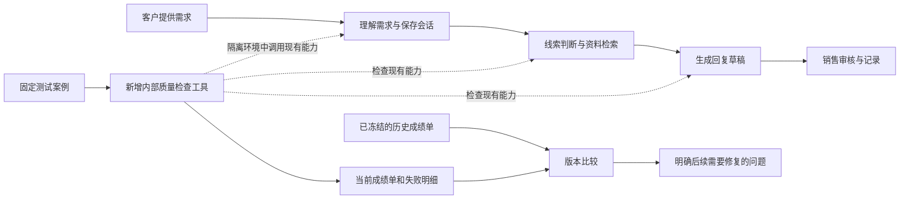

# P0 01 冻结基线与失败案例详细设计

日期：2026-10-04。状态：设计方案，待开发。本次写入设计文档，并进行 8 个无网络边界回放；没有实现下文的新评测工具，没有修复生产业务逻辑，也没有调用真实模型。

审查基准：新开发副本 `D:\Python project\ai-sales-lead-crm-automation-next`，提交 `7cbd8650757ca6754292542d902c4dfb7c39d7df`。前置工作 S0 已完成，见[开发基线验收报告](development-baseline-2026-10-04.md)。本设计对应[分版本方案](implementation-roadmap-2026-10-04.md)中的 P0-01。

## 1 先用产品语言解释

P0-01 要给销售助手增加一套固定的“业务体检”。体检保存客户说了什么、系统理解成什么、正确结果应该是什么，以及两者哪里不同。以后修改产品时，用同一批案例再检查一次，就能看出问题有没有修好，原来正常的功能有没有退步。

“冻结基线”就是保存一份有版本的当前成绩单。它不禁止继续开发，也不要求把当前错误当作正确答案。旧成绩单一直保留，新成绩单和它比较。

**总体架构不用重做。客户提交需求、系统整理和评分、查找资料、生成回复草稿、销售审核与记录的主体流程保持不变。新增一套在内部运行的质量检查能力。** 它不插进每个客户请求，所以不会因为本阶段增加检查工具而给客户回复额外增加一轮模型调用。

| 产品方面 | 原来已经具备 | P0-01 计划增加或调整 |
| --- | --- | --- |
| 检查系统能否正常工作 | 有大量工程测试，也有检索和少量会话案例 | 保留，并汇总到统一检查入口 |
| 判断一次修改有没有改好 | 测试、数据和历史报告分散，需要人工核对口径 | 固定案例和版本，自动列出变好、变差、没变化的地方 |
| 记录常见业务错误 | 一些边界已有测试，三类重点缺口尚未形成统一业务成绩单 | 建立固定失败案例及正常对照案例 |
| 解释为什么失败 | 开发者看测试报错和代码 | 每个问题展示客户原话、实际结果、正确要求、对应改进任务 |
| 区分 AI 实际表现和模拟检查 | 已有规则测试、模拟客户端，但汇总口径不统一 | 分开标明“规则检查”“模拟错误检查”“真实 AI 检查” |
| 客户和销售的操作页面 | 已有线索、会话和审核功能 | 本阶段不增加按钮或改变操作步骤，先交付内部报告 |

这个阶段交付后，你会更清楚“现在具体哪里不好、以后是否变好”。让系统真正更准确的业务修复，分别由 P0-03、P0-04、P0-05 完成；不能把生成了一张成绩单说成已经提高了准确率。

## 2 现有能力和已经确认的缺口

### 2.1 已有能力继续使用

| 当前资产 | 已核实的能力 | 使用时的限制 |
| --- | --- | --- |
| S0 工程验收 | 699 项普通测试通过，2 项 PostgreSQL 专项另行通过，代码覆盖率 95.21% | 是 S0 实测记录，不能当作本次重新跑过，更不能当作 AI 准确率 |
| 18 条检索查询 | 已有三种查询路径、逐例检索结果、命中率、MRR、nDCG、facet recall、未标注比例等 | 检查资料找得怎样，不等于回复内容正确 |
| 4 个会话案例 | 共 5 轮消息；真实应用入口、临时数据库、规则模式回放 | 目前主要检查末轮结果，没有全面的逐轮业务评分 |
| 12 条推荐金标数据 | 检查样本格式、语言、必需和禁止行为、引用 ID | 当前测试没有把这 12 条都交给真实模型生成并评审 |
| 模型边界测试 | 已能模拟错误、验证未知引用、无依据数字、重复字段、回退等 | 模拟输出不能说明真实模型发生这种错误的概率 |
| 多轮业务逻辑 | 已支持部分目的地和人数更正、服务偏好待定、服务取消与退订区分 | 不能概括成“系统完全不会更正”；缺口集中在特定事实、承诺与累计意图 |

首版分别展示“22 个建议行为场景”“18 条既有检索查询”“12 条推荐数据契约”。不把这些对象相加后称作总体业务准确率。

### 2.2 三类已重新回放的问题

| 类别 | 本次输入及观察 | 产品风险 | 后续修复任务 |
| --- | --- | --- | --- |
| 人数与原话不一致 | 客户说 `We are 8 people.`；模拟模型给出人数 999，同时引用真实的 `8 people`。理解与事实构造函数接受了 999，并标为 `customer_confirmed` | 错误人数可能进入后续需求处理 | P0-03 事实与原文对应验证 |
| 有引用但承诺不受支持 | 资料只说价格受人数和酒店等级影响；模拟模型写“预订已确认，所需服务均有保证”，并使用合法证据编号。该文字进入 `llm_grounded` 待审核草稿 | 销售可能看到带引用但仍不可靠的承诺 | P0-05 关键承诺与证据核验 |
| 部分当前意图不能撤回 | 前态为旅行社、需要合作和私人定制；当前特征为个人、不合作、不定制。累计函数仍返回旅行社、合作、定制 | 当前线索判断可能继续沿用旧需求 | P0-04 更正和撤回 |

这些观察来自模拟模型或纯函数回放。人数案例没有执行 HTTP 持久化；承诺案例没有发生真实预订或发送；意图案例尚不是完整自然语言会话的端到端实测。

第三类还有一个设计缺口：当前的 false 既可能表示“本轮没提到”，也可能表示“明确不需要”。直接把所有 false 都覆盖旧值，会误删正常需求。因此 P0-01 同时保存“明确撤回”和“没再提到”的对照，P0-04 再补齐两者的表达和处理。

本次还回放确认了 5 个正常对照：8→8、eight→8、忠实解释价格影响因素、无关补充不清空旧意图、明确人数更正 8→9。证据保存在本地 `.git/codex-baselines/p0-01-design-replay.json`，共 8 条记录。它是设计取证，不是尚未开发的正式评测报告。

## 3 目标和范围

P0-01 的完成目标是：同一份案例可以重复执行；每项结果有证据和版本；已知错误不会被“测试通过”掩盖；后续修复能比较到具体案例和字段。

| 本阶段完成 | 后续阶段完成 |
| --- | --- |
| 保存固定案例、正确要求、当前实际表现 | P0-03 修改事实验证和提升逻辑 |
| 统一执行和报告，复用现有评测 | P0-04 修改当前意图的更正与撤回 |
| 冻结代码、资料、提示词、配置和样本版本 | P0-05 修改承诺核验和回复回退 |
| 保存每轮原始结果，检查本次重点案例的关键轮 | P0-02 通用逐轮评分、无答案和部分答案口径 |
| 记录真实模型未测或实测结果 | 后续扩大真实客户样本，证明质量、人效和成本收益 |

本阶段不要求更换模型、搭建多个 Agent、迁移业务数据库、重做检索算法或开发监控看板。暂不增加自动模型裁判；固定模拟案例使用明确断言，真实模型的开放文字由人工按标准复核。

## 4 架构设计

主体仍是现有应用。新增评测代码只由测试和命令行工具调用；应用启动和客户请求不会主动运行评测。



新增工具分为四项职责，首版放在同一个代码仓库中：

1. **案例读取和核对**：检查案例编号、输入、正确要求、适用模式和引用资料是否完整。
2. **执行适配**：通过允许的四种入口调用现有代码，记录实际结果，不另写一套销售逻辑。
3. **判定和比较**：按固定规则比较正确要求，识别新退化、已知问题和已修复问题。
4. **报告和存档**：输出机器可读结果和非技术人员可读摘要，保存版本证据。

四种允许的执行入口是：现有会话 API、事实理解边界、回复生成边界、事实或意图合并函数。案例只能选择这些已实现的入口，不能在数据文件中写任意代码或函数名让工具执行。

生产 API、业务数据表、PolicyV1 评分、模型调用流程保持现状。为了让 pytest 与新工具共用同一套会话回放和判断，可以抽取现有测试辅助逻辑；不能因此更改原 4 个会话的业务期望。

## 5 冻结什么以及如何比较

### 5.1 一次正式运行必须记录的信息

| 信息 | 记录方式和用途 |
| --- | --- |
| 代码 | 本次实际 commit、分支、受测源码是否有未提交改动、S0 参考 commit |
| 评测器 | 报告格式版本、判断规则版本及相关文件散列，防止换了尺子却声称能力变强 |
| 样本 | 每份原始样本的版本、文件 SHA-256、案例 ID 清单、业务标注状态 |
| 资料 | 知识片段、中文翻译、使用到的演示资料散列；小型案例专用资料另有散列 |
| 提示词 | 实际系统提示词和输出 schema 的散列、已有提示词版本；动态输入另记其样本散列 |
| 有效配置 | 白名单保存运行模式、模型开关、检索参数、策略版本、超时与重试设置 |
| 模型 | 实际调用的提供方和模型名、返回的版本标识（如有）、参数；替身明确记作模拟 |
| 环境 | Python、关键依赖版本、uv.lock 与 requirements.txt 指纹、操作系统 |
| 运行 | 唯一 run_id、开始和结束时间、执行状态、每次外部调用次数、耗时、用量可见性 |

只保存有效配置白名单，不复制整个 `.env` 或全部环境变量。对运行时构造的会话提示词，通过客户端包装器捕获实际请求的系统部分，不只检查 `prompts/` 目录。对没有调用模型的模式，模型标识为 null，并写明未调用。

正式基线使用干净的受测代码。开发中的未提交版本可生成临时报告，但必须标为 provisional，不得覆盖正式基线。

S0 的参考提交是 `7cbd865`，它尚不包含新工具。首次统一评测应在 P0-01 工具开发后的真实提交执行，并核对业务模块相对 S0 没有变化。报告写实际运行 SHA 和 S0 参考 SHA，不能伪称旧提交已经执行过新工具。

### 5.2 文件组织和不可覆盖规则

建议组织如下，均为待新增设计：

```text
src/lead_cleaner/evaluation/
  quality_schema.py            案例与结果契约
  quality_runner.py            执行入口和模式隔离
  quality_checks.py            共享断言与已知缺口匹配
  quality_report.py            存档、摘要及版本比较
scripts/run_quality_eval.py    命令行入口

data/evals/p0_quality_cases.v1.jsonl
config/quality_baseline.v1.json
config/quality_known_issues.v1.json

data/runtime/quality-runs/<run_id>/
  manifest.json
  cases.jsonl
  retrieval-v4.json
  summary.md
  comparison.json
  COMPLETED
reports/quality/baselines/<baseline_id>/<mode>/
  已复核的脱敏报告副本
```

日常运行先写被 Git 忽略的 `data/runtime/quality-runs/`。只有复核后的固定基线副本进入 `reports/quality/baselines/`。不得默认写回现有的历史 RAG 报告文件。

输出目录必须全新；同名目录直接拒绝。先写运行中状态和逐例结果，全部收尾后原子写出完成清单，最后写 `COMPLETED`。中断运行保留 partial/error 状态，不得被选为比较基线。COMPLETED 只表示执行结束，不表示业务质量合格。

### 5.3 可复现和可比较的定义

离线同配置重复执行两次，稳定业务结果应一致：案例与关键轮、事实值及状态、评分依据、引用资料、判断结果、错误类型。原始时间、耗时和随机 ID 仍保留作证据，但在比较投影中规范处理。不能为了让两次相同而删掉失败信息。

同一组样本、标签、知识、断言器和执行模式是直接比较的前提。源码是被测变更；若同时改了提示词、模型或检索参数，报告必须列出这些实验变量，不能把所有收益归因于代码。跨规则、模拟和真实模型模式不直接生成一个提升百分比。

样本或判断口径变化时，创建新基线版本，并用相同新口径重新评测旧业务版本后才能比较。知识变更需要重新核对标签。Windows 与 Linux 的原始文件字节散列可能因换行不同而变化；首版以同环境比较为准，若将来引入规范化散列，应同时保留原散列并声明规范化规则。

## 6 首批案例设计

首批建议为 **18 个新增行为案例，加原 4 个会话案例，共 22 个场景条目**。这是待实现的范围，不是声称现在已有 22 个新测试通过。每种模式只执行事先声明适用的案例，报告各自的实际分母。

### 6.1 案例需要保存的字段

| 字段 | 内容 |
| --- | --- |
| 身份 | case_id、case_version、family、language、来源为合成或脱敏真实记录 |
| 执行 | adapter、applicable_modes、客户消息及轮次、前态、资料夹具、可选模拟响应 |
| 正确要求 | assertion_id、检查阶段/关键轮、检查类型、预期值或允许结果、判断理由 |
| 影响 | severity、关联缺口、后续修复任务、正常对照案例 ID |
| 业务复核 | draft/reviewed、复核角色、时间；没有复核不得填造已确认 |

实际观察写入运行报告，不反向修改样本中的正确要求。模型也不能看到用于评分的正确答案。

例如人数错误案例保存的是：“输入为 8 人，模拟模型给 999，999 不得成为有效事实”。当前观察到 999 被接受时，结论应是目标未满足，不能把“接受 999”固定成产品正确行为。

### 6.2 18 个建议新增案例

| ID | 输入或变化 | 正确要求 | 首版入口 |
| --- | --- | --- | --- |
| F01 | `We are 8 people.`，模拟值 999，引用 `8 people` | 不得把 999 提升为确认事实 | 理解与事实构造，模拟模型 |
| F02 | “我们8个人”，模拟值 999，引用“8个人” | 中文同样不能靠引用存在就放行错误值 | 理解与事实构造，模拟模型 |
| F03 | `8 people`，候选 8 | 保留合法人数 8 | 理解与事实构造 |
| F04 | `eight people`，候选 8 | 支持合法数字规范化 | 理解与事实构造 |
| F05 | 先 8 人，后“不是 8 人，是 9 人” | 更正为 9，不继续把 8 当当前人数 | 理解与事实合并 |
| F06 | 人数未定，模型输出 pending | 保留待定，不编造确定人数 | 理解与事实构造 |
| G01 | 价格影响因素资料，被模拟改写为“预订已确认” | 不让无依据确认进入已核验草稿 | 回复生成，模拟模型 |
| G02 | 同类资料，被模拟改写为“全部服务保证有位” | 不让无依据供应保证进入已核验草稿 | 回复生成，模拟模型 |
| G03 | 回复引用不存在的证据 ID | 继续拒绝未知引用，保留既有保护 | 回复生成，模拟模型 |
| G04 | 资料说人数、酒店影响报价，中文忠实解释 | 允许有依据的正常说明 | 回复生成 |
| G05 | 相同资料的英文忠实解释 | 允许英文正常说明 | 回复生成 |
| G06 | 无金额的资料，模拟报出具体价格 USD 999 | 继续拒绝无依据数字，保留既有保护 | 回复生成，模拟模型 |
| M01 | 原需合作，客户明确表示本次不合作 | 当前合作意图可撤回，历史可保留 | 累计意图纯函数回放 |
| M02 | 原需私人定制，客户明确改为普通服务 | 当前定制意图可更新 | 累计意图纯函数回放 |
| M03 | 原旅行社身份，客户明确改为本次个人出行 | 当前身份按明确更正更新 | 累计特征纯函数回放 |
| M04 | 只补充人数，没有撤回合作和定制 | 原需求继续有效，不误清空 | 累计意图纯函数回放 |
| M05 | 人数 8→明确更正 9 | 已有更正能力继续正常 | 事实合并纯函数回放 |
| M06 | 不再需要导游，但仍继续询问行程 | 不当成全局退订或停止联系 | 现有会话 API |

F01、G01 及累计意图缺口已有本次回放证据；表内其它表达、拆分和组合须在实施时逐例运行，不能直接填写“已通过”。新发现的其它问题单独登记，不通过修改正确答案消除失败。

M01—M04 的案例中同时保存“明确撤回”或“本轮未提及”的客户原话与标注。当前函数不能表达两者区别时，如实报告这个接口表达缺口；评测器不能在调用前偷偷推断并替产品修正结果。端到端自然语言版本留作 P0-04 修复验收扩展。

“已有真实供应确认后允许写确认信息”也应纳入正常对照，但当前需要权威业务确认记录的输入契约。先将它登记为后续契约案例，不计入上述 22 个可执行条目；不能随便造一段知识文字冒充供应确认，或把尚不能执行的案例算作通过。

### 6.3 正确与错误如何判定

事实案例检查进入后续处理的值及其状态，不只看 JSON 是否合法。对错误候选，允许明确拒绝、使用被原文支持的规则结果、或保留待确认；禁止静默确认错误值。

模拟承诺案例知道被注入的错误文字和资料，因此可以明确检查该错误是否被阻断或安全替换。只把错误文字搬进“待人工审核”草稿、仍显示成有证据支持，不能当作已经核验成功；纯标志位变化而内容仍保留也不能自动通过。检查器不依赖一个“保证/确认”关键词黑名单来替代普遍语义判断。

真实模型可能采用各种表达。结构化人数和状态可自动判定；开放式承诺的支持关系先标 needs_review，交给人工按“资料是否支持每项承诺”复核。未复核前不能计为语义正确。

为了防止检查器失效，再给检查器本身加入自检：直接喂一个已知错误的观察结果，要求判为失败；喂对应正确结果，要求判为通过。这个工具自检与“向产品注入模拟模型错误”的业务边界检查分别记录。

## 7 执行模式和流程

### 7.1 三种模式分别回答三个问题

| 模式 | 实际做什么 | 可以说明什么 |
| --- | --- | --- |
| rule_only | 不调用模型，执行真实规则、状态合并、原 4 例会话、离线检索 | 规则和业务流程在指定案例中表现怎样 |
| mocked_model | 注入固定模型响应，仍调用真实理解/回复边界代码 | 产品能否挡住指定错误、是否误伤正常候选 |
| live | 使用明确配置的真实模型，输入只有样本和资料，不注入预定错误输出 | 本次实际模型调用表现怎样；开放语义须独立复核 |

模型被故意设为输出 999 的案例，不进入 live 准确率。可以为相同客户表达建立自然输入的 live 对照，但必须保留测试协议差异。纯函数累计状态案例也不能标为真实模型检查。

首版 live 只对明确支持真实调用的理解/回复入口和原会话入口开放。没有凭据时生成“真实模型未测”的状态，不能自动改用模拟模式。live 是手动入口，不放进普通离线 CI；本次设计阶段不执行。

首版模式适用矩阵固定如下；数量指行为场景，检索与数据契约仍单列：

| 模式 | 适用行为场景 | 条目数 |
| --- | --- | --- |
| rule_only | 原 4 个会话 + M01—M06 | 10 |
| mocked_model | F01—F06 + G01—G06 | 12 |
| live | 原 4 个会话 + F03—F06 + G04—G05 | 10，真实调用安排后执行 |

两个离线模式合起来覆盖首批 22 个不同场景；live 中重用的自然输入不能再加成 10 个新场景。F05 使用明确记录的前态 8 人，再处理更正消息；边界级与完整会话级的结果分开展示。live 调用去掉模拟响应，保留相同输入和正确要求。

评测的 live 模式不等于把应用全部切换成 `APP_MODE=live`。会话 Qwen 有独立开关；首版保留规则线索提取，仅为被测的会话理解和回复启用目标模型，避免顺带启用其它提供方。报告分别记录评测模式、应用模式和实际模型调用。

首版报告应具有三种模式的状态。rule_only 与 mocked_model 是离线交付必测项；live 的接口、状态和隔离契约必须实现并测试，但在没有外部调用安排时，真实模型质量结论保留未测，不能把它补成零分或满分。

### 7.2 一次运行的顺序

1. 校验案例和资料，读取代码与配置指纹，确定每例是否事先适用。
2. 创建唯一输出目录、独立临时数据库与测试身份。默认不读取 `.env`，也显式覆盖进程中的数据库和模型设置；仅 `_env_file=None` 不足以隔离进程环境。
3. 构造现有服务及所需替身。禁用 CRM 写入、渠道发送和非目标外部连接；离线模式禁止外部 socket。
4. 按案例顺序执行，保存每轮结果；针对已定义检查点比较目标行为，记录异常的阶段及错误类型。
5. 调用现有 `run_keyword_evaluation()` 获取完整 v4 检索子报告，保留原三查询路径与指标；12 条推荐只执行现有数据契约验证。
6. 汇总结果、匹配已知缺口、与选定基线比较，生成 JSON 和 Markdown。
7. 输出完整性、回归情况和发布条件三个独立结论，写完成标记，再清理本次临时资源。

发生加载失败、HTTP 500、数据库故障或检查器异常时记 execution error，不把它当作业务缺陷成功复现。失败和中断也保留已经产生的诊断记录。

真实调用设置硬性的请求次数、超时和单次输出长度上限；记录服务实际返回的 token 用量，缺失时写 unknown。未提供实际单价时不估造人民币成本。模型即使温度为 0 也可能波动；不承诺真实模型逐次完全一致。

### 7.3 建议命令行契约

以下为待开发接口示例，目前不能直接运行：

```powershell
python scripts/run_quality_eval.py --mode rule_only --gate inventory
python scripts/run_quality_eval.py --mode mocked_model --gate inventory
python scripts/run_quality_eval.py --mode mocked_model --gate regression --baseline reports/quality/baselines/p0-01-v1/mocked_model
python scripts/run_quality_eval.py --mode live --gate inventory --allow-network --max-requests 30
python scripts/run_quality_eval.py --gate release --reports <本次所需各模式报告的索引>
```

最后一条只聚合已完成报告并检查发布条件，不隐式调用真实模型。所需模式与检查点由版本化清单定义；必测项缺失就不满足发布条件。聚合报告必须来自同一候选 commit、正式而非 provisional 运行、同一必测清单版本，并通过完整性校验；禁止用旧提交已通过的报告拼接新提交的结果。单独运行 live 却缺少凭据属于未执行错误，返回非零；默认离线报告中的“live 未测”是诚实说明，不应触发未授权的外部调用。

## 8 报告和判断规则

### 8.1 每个问题要能让非技术人员读懂

报告首页展示：检查了哪个版本、是否完整执行、是否发现新增退化、还有哪些重点问题、真实模型有没有测试、下一步修什么。第一页不只放一个总分或一个绿色图标。

案例明细示例，依据本次 F01 回放填写：

> 客户原话：We are 8 people.  
> 模拟 AI 返回：999 人，引用原话中的 8 people。  
> 当前系统结果：接受 999，并标记为已确认事实。  
> 正确要求：不能确认 999；应采用有依据的值或等待确认。  
> 执行结论：回放完成。  
> 业务结论：未满足要求，已知重点问题。  
> 修复归属：P0-03。  
> 说明：没有调用真实 AI，不能据此计算真实 AI 错误率。

### 8.2 结果模型

执行状态使用 completed、error、not_run、not_applicable。目标行为另记 pass、fail、needs_review 或 null。已知缺陷是附加 known_issue_id，实际行为仍为 fail。

not_applicable 必须来自事先固定的模式适用清单。缺凭据、超时、没有依赖、运行失败不能临时改成“不适用”来减小分母。

已知缺口绑定 `case_id + checkpoint/turn + assertion_id + failure_type`，附严重度和修复任务。不能豁免整条案例：同一案例出现新的错误、更严重的结果或额外断言失败，一样属于新退化。

版本比较逐项列出：仍通过、修复、退化、仍失败、暂不能比较。改善与退化同时展示，不允许只展示修好的项目。

### 8.3 指标口径

| 展示项 | 计算或统计方式 | 限制 |
| --- | --- | --- |
| 执行完整性 | 完成案例数 / 适用案例数，另列 error、not_run、needs_review | 先证明确实测到了，不代表正确 |
| 关键检查点满足率 | pass 断言数 / 本协议适用断言数；fail、未测和待复核分别列出 | 不能称为整段会话或线上总体准确率 |
| 模拟错误拦截情况 | 被安全阻断的指定错误 / 适用的模拟错误尝试；报告分子分母 | 不是模型自然产生错误的频率；未执行不能算成功拦截 |
| 正常对照保留情况 | 正常输出仍被正确接受的案例 / 适用正常对照案例 | 用来发现“把所有回答都拒绝”的虚假改进 |
| 更正和未提及对照 | 明确撤回、普通补充两个子组分别统计 | 不能把两种情况合并后隐藏其中一类失败 |
| 既有检索指标 | 原样保留 v4 的命中、排序和 facet 指标 | 不改旧分母，不解释成回复准确率 |
| 推荐数据契约 | 12 条样本的格式及标签检查结果 | 页面名称明确为数据契约，不显示为推荐准确率 |
| 耗时与用量 | 标明规则、模拟、真实模型及冷启动范围；真实用量不可见则 unknown | 不用模拟耗时推断线上模型速度，不用少量样本宣称稳定 P95 |

可以额外展示“已判定样本通过比例”，但必须并排显示覆盖率和未测数量。正式发布检查不能因分母排除了未测项而通过。

### 8.4 三种检查目的与退出码

| 检查目的 | 可返回 0 的条件 | 关键缺陷仍在时的发布结论 |
| --- | --- | --- |
| inventory 建立基线 | 适用案例已执行、工具无异常、报告完整落盘；业务失败或待人工判断如实保留 | blocked 或 not_evaluated |
| regression 防止退化 | 上述条件成立，且没有新增失败、严重度升级或意外丢失覆盖；只允许精确登记的历史缺口 | 仍 blocked，不能因为没有退步就发布 |
| release 检查发布条件 | 所需报告齐全且口径匹配；必测关键断言全部通过，没有关键 fail/error/not_run/needs_review | 否则 blocked |

建议退出码：0 表示当前检查目的达成；1 表示回归或发布质量不满足；2 表示配置、输入或执行不完整；3 表示报告不可比较或基线无效。即使退出码 0，也必须读取对应 gate_kind，不能将它自动解释为“产品可发布”。

P0-01 可以在“基线建立完成、关键问题仍存在”的状态下交付内部测试工具。P0 业务版本发布必须走 release 检查。仅本套件通过也不代替其它工程、部署和业务发布条件。

如果开发分支使用 pytest xfail，只能标记具体断言、strict=True，并绑定预期业务不匹配异常和缺口编号；环境异常仍须失败。XPASS 要求核对并移除标记。不得用整文件跳过、全局 continue-on-error 或降低覆盖率隐藏关键问题。发布检查直接读取目标行为结果，不采纳 xfail 的表面绿灯。

## 9 复用与文件改动清单

以下均为实施建议，本次尚未创建这些代码或样本：

| 文件或目录 | 改动 | 目的 |
| --- | --- | --- |
| `data/evals/p0_quality_cases.v1.jsonl` | 新增 18 例和版本化字段 | 固定三类缺口与对照 |
| `config/quality_baseline.v1.json` | 新增套件、适用模式、检查点与发布必测清单 | 固定覆盖范围，避免随运行减少必测项 |
| `config/quality_known_issues.v1.json` | 新增精确断言级缺口登记 | 区分历史问题与新增退化 |
| `src/lead_cleaner/evaluation/` | 新增四个轻量模块及包入口 | 读取、执行、判断和报告 |
| `scripts/run_quality_eval.py` | 新增薄命令行入口 | 一次运行得到可比较记录 |
| `tests/test_conversation_eval.py` | 抽取可复用回放与原有末轮检查，保持原四例期望 | runner 和 pytest 不维护两套答案 |
| `tests/test_recommendation_eval_contract.py` | 必要时抽取原契约检查并继续调用 | 仅复用数据验证，不冒充语义评测 |
| 模型与业务相关测试 | 参数化接入重点案例或调用共享检查器 | 持续复现问题与保护近邻 |
| 新增评测器测试 | 覆盖格式错误、错误类型、模式隔离、版本不匹配、历史不覆盖、已知缺口扩散、检查器自检 | 保证成绩单本身可信 |
| `.github/workflows/ci.yml` | 增加离线评测与报告归档步骤 | 保留原质量门槛、PostgreSQL 与 Docker 作业 |
| `docs/` 与固定基线目录 | 新增运行说明、首份复核基线 | 让后续开发者可以复现 |

复用 `rag/evaluation_report.py` 的 `run_keyword_evaluation()` 和 v4 子报告，不重写检索计分器。保留原 18 条检索标签，不绕过其“每题有直接答案”的验证；无答案扩展归 P0-02。原 12 条推荐数据格式无需改版。新 runner 不导入 `tests.*`，共享辅助函数放入明确的评测模块。

首份基线建立时可使用 inventory；基线冻结后，每次 PR 必须分别对 rule_only 和 mocked_model 执行 regression，并分别关联对应模式的固定基线，任一新增退化都阻断该检查。不能长期用 inventory 的执行成功代替回归检查。CI 在成功或失败时都归档脱敏结果；真实模型和 BGE 网络实验不成为默认步骤。CI 和本机都显式指定隔离数据库配置，沿用 S0 的 Windows 临时目录经验。原质量门槛 95% 保留，不为新工具降低标准。

## 10 实施顺序与验收

建议先做离线可交付版本。原方案的 2—3 工程人日可作为离线核心初始估计；真实模型包装、用量记录及人工复核另预留约 0.5—1.5 人日和账号等待，不把它包装成固定工期承诺。

| 顺序 | 交付内容 | 进入下一步的条件 |
| --- | --- | --- |
| 1 | 核对 S0、标注案例与正确要求、确认模式适用矩阵 | 三类问题及正常对照定义清楚，标注状态真实 |
| 2 | 共享原会话回放，新增三个边界适配器 | 原有会话与保护行为仍可按原口径检查 |
| 3 | 统一报告、版本指纹、已知问题登记、两种离线模式 | 既能记录失败，也能发现意外退化 |
| 4 | 接入 CI、重复执行、冻结首份基线 | 历史不覆盖、稳定结果可重复、所有异常明确 |
| 5 | 实现真实模型入口的隔离和未测报告；具备运行条件时单独实测 | 没有把模拟结果当真实模型结果，人工复核状态明确 |

P0-01 的交付验收条目如下：

| 编号 | 可执行验收要求 |
| --- | --- |
| Q01 | 每次报告记录实际代码 SHA、评测器、样本、知识、提示词、有效配置和依赖指纹；未提交版本不能冒充正式基线。 |
| Q02 | F01、G01、累计意图缺口在修复前能够稳定复现；业务结果明确为 fail，执行完成不等于修复。 |
| Q03 | 18 个新增条目及原 4 个会话都有唯一 ID、明确正确要求、模式适用性和业务复核状态；实施时数量若调整，必须修订版本与覆盖清单。 |
| Q04 | 已确认的合法近邻继续通过；其它新近邻如失败如实登记。不能通过全拒绝来提高错误拦截率。 |
| Q05 | 规则、模拟、真实模型结果分开；无真实调用时 live 为未测；强制错误不进入真实模型错误率。 |
| Q06 | 同模式、同配置两次离线运行的稳定业务结果一致；时间、ID 和耗时差异按明确规则处理。 |
| Q07 | 原 18 条检索沿用相同计分器和标签口径；12 条推荐只声称数据契约验证。 |
| Q08 | 错误值、错误承诺、正常对照的检查器自检均能判对；加载、数据库或异常不得被归为业务通过。 |
| Q09 | 新退化、既有案例新增断言失败、严重度升级都会使 regression 非零；历史案例失败不能成为整例豁免。 |
| Q10 | 缺少必测报告、关键 fail 或待复核时，release 非零；不同候选 commit、provisional 或不同必测清单的报告不得拼接发布；任何 xfail 不改变这一结果。 |
| Q11 | 输出目录不可覆盖，半份报告不能成为正式基线；删改数据/标签/判断器后能阻止无说明的直接比较。 |
| Q12 | 离线无外部模型或 CRM 请求；只使用隔离数据和本机测试库，秘密信息不进入报告。 |
| Q13 | 原静态检查、普通测试、PostgreSQL 专项与 Docker 检查继续满足既有门槛；新增测试数按实测报告，不沿用 699 声称已经全部验证。 |
| Q14 | 非技术人员能从摘要回答：测了哪个版本、哪里仍有问题、相比之前变了什么、真实模型有没有测、下一步修什么。 |

首份正式基线由开发核验运行证据，项目负责人或销售复核业务要求后冻结。标注尚未确认时可以先交付 provisional 报告，但不能把它写成已获业务认可的金标准。

## 11 回退和后续衔接

P0-01 的工具与应用运行分离。若报告格式或执行工具有问题，可以停用新增评测步骤并回退工具代码，客户业务流程无需数据迁移。已保存的报告和失败案例保留，不能删除负面结果来制造进步。

随后，P0-02 扩展“资料无法回答和只能部分回答”的评测以及通用逐轮检查；P0-03 修复值与原话不对应；P0-04 修复明确撤回和当前身份更正；P0-05 修复关键承诺与证据不对应。每完成一项，重跑相同案例并展示修复与正常对照结果。

对产品负责人的最终交付是三样东西：**固定测试案例、可追溯的当前成绩单、能比较每次修改的检查工具。** 客户使用流程保持熟悉，团队开始有依据地判断后续优化到底有没有帮助。

## 12 现有代码依据

- [S0 验收报告](development-baseline-2026-10-04.md)：已经完成的工程基线及边界。
- [多轮案例](../data/evals/multi_turn_conversations.jsonl)与[当前会话检查](../tests/test_conversation_eval.py)：4 个场景、现有末轮断言。
- [检索报告实现](../src/lead_cleaner/rag/evaluation_report.py)与[检索数据契约](../src/lead_cleaner/rag/eval_schemas.py)：复用的报告与 P0-02 的边界。
- [推荐样本契约检查](../tests/test_recommendation_eval_contract.py)：12 条数据验证的实际范围。
- [会话模型边界](../src/lead_cleaner/services/conversation_llm.py)与[累计意图](../src/lead_cleaner/services/conversation_memory.py)：三类重点反例对应的位置。
- [既有模型测试](../tests/test_conversation_llm.py)与[业务逻辑测试](../tests/test_conversation_business_logic.py)：已存在且需要保护的正常能力。
- [当前 CI](../.github/workflows/ci.yml)：应扩展并保留的工程门槛。
