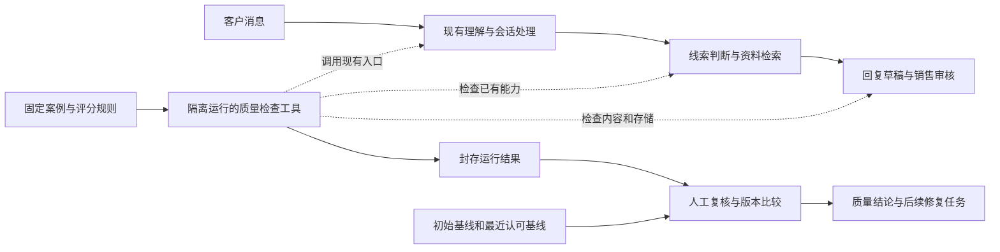

# P0-01 冻结基线与失败案例最终方案设计报告

版本：1.0。日期：2026-10-04。状态：**设计定稿，待开发和业务标注复核**。

本文合并原详细设计与二次审核结论，是 P0-01 后续开发和验收的主要依据。原设计和二审报告作为历史依据保留；有差异时按本文执行。本文中的接口、文件和验收要求属于待实现规格，不代表已经开发或通过测试。

## 1 产品结论

**总体架构无需重做。P0-01 为现有销售助手增加一套内部质量检查工具，用固定客户案例检验系统，保存成绩单，并比较不同版本。** 客户提交需求、系统整理信息、查找资料、生成草稿、销售审核和记录的主体流程继续沿用。

“冻结基线”是保存一份有版本的成绩单，不是冻结开发。正确答案与当前实际表现分别保存；已知错误必须记为失败，不能因为它一直存在就变成正确答案。

| 产品能力 | 现状 | 本阶段完成后的变化 |
| --- | --- | --- |
| 查看系统问题 | 工程测试、案例和报告分散 | 统一展示客户原话、系统结果、正确要求和失败原因 |
| 判断版本是否变好 | 需要人工拼接证据 | 自动列出修复、新退化、仍然存在的问题和无法比较的项目 |
| 防止问题再次出现 | 部分能力有固定测试 | 同时对照最初版本和最近一次认可的版本 |
| 判断 AI 是否正常 | 模型成功与模板兜底容易混淆 | 分别说明系统是否可用、模型有没有成功、答案是否正确 |
| 检查客户资料是否保存正确 | 部分测试检查返回值 | 关键错误继续检查数据库中的实际结果 |
| 客户及销售操作 | 已有页面与审核流程 | 本期交付内部报告，不增加业务操作步骤 |

本阶段的成果是“能够可信地发现和比较问题”。人数理解、需求撤回和错误承诺的业务修复继续分别由 P0-03、P0-04、P0-05 完成。P0-01 不承诺仅靠建立评测就提高线上准确率。

## 2 前提与证据边界

开发副本为 `D:\Python project\ai-sales-lead-crm-automation-next`，分支 `codex/p0-quality-baseline`。代码审查基准是 `7cbd8650757ca6754292542d902c4dfb7c39d7df`。首次正式评测必须记录工具实际运行时的提交，不能把尚未包含工具的旧提交写成实际运行版本。

S0 已完成，其历史记录包括 699 项普通测试、另行验证的 2 项 PostgreSQL 测试及 95.21% 覆盖率。这些数字不是本轮重新执行的结果，更不是 AI 准确率。现有工程质量门槛继续保留。

设计审查已有以下证据：

| 观察 | 已验证的范围 | 本阶段如何使用 |
| --- | --- | --- |
| 客户说 8 人，模拟模型给 999，系统接受为确认人数 | 二审通过会话 API，并重新打开隔离数据库读回验证 | F01 固定为必须识别的失败案例 |
| 无预订确认资料，模拟模型声称预订已确认 | 错误文字进入带 `llm_grounded` 标记的待审核草稿；未发送、未预订 | G01 检查内容、证据、状态和存储结果 |
| 部分合作、定制、旅行社身份不能明确撤回 | 纯函数回放；尚未证明完整自然语言链路 | M01—M04 保存撤回与未提及对照，明确接口表达缺口 |
| 模型成功与超时被旧断言混淆 | 模拟成功的原四例均被模板方式断言拒绝，其中两例其它旧断言全部通过；模拟超时的四例旧检查全部通过 | 为不同模式设置不同评分规则 |
| 同样更正为 9，前态确认等级影响合并 | 三函数回放：客户确认旧值可改为 9，人工确认旧值进入冲突；未对 F05 做 API 及来源字段专项验证 | 明确 F05 前态和完整处理链，增加适配器自测 |

首轮设计取证 8 条，二次审核另有 13 项记录；均不是新工具生成的正式评测报告，均未调用真实模型。其它新增案例须在实施时逐条执行，不能预填通过。

## 3 交付范围与架构

### 3.1 本期范围

本期完成案例契约、共享执行入口、模式评分、版本记录、双基线比较、不可覆盖报告、人工复核记录、CI 回归和真实模型实验接口。实际付费模型实验可以后续单独安排；没有实测时明确保留未测。

本期不修改生产 API、业务表结构、PolicyV1、业务事实合并策略、模型提示词、检索算法和客户操作流程。允许提取测试辅助逻辑、注入评测客户端、在评测侧记录调用与用量，但不得改变受测业务行为。

通用逐轮评分、无答案与部分答案体系属于 P0-02；事实校验、意图撤回、承诺约束属于后续修复；80—120 个场景和业务试点指标属于整体 P0 发布范围，不能用本期 22 个场景替代。

### 3.2 架构关系



评测是同仓库的旁路工具，由命令行或测试触发。客户请求不调用它，因此不因本期评测工具而额外增加在线模型调用。

### 3.3 模块职责

| 待新增模块 | 职责 | 边界 |
| --- | --- | --- |
| `quality_schema.py` | 案例、观察、断言、版本及报告契约 | 严格校验未知字段、重复标识和适用范围 |
| `quality_runner.py` | 隔离资源、调用现有入口、记录阶段和模型调用 | 不重新实现销售业务逻辑 |
| `quality_checks.py` | 共享断言、模式评分、已知缺陷匹配与回归判断 | 正确要求独立于当前错误表现 |
| `quality_report.py` | 封存、复核集合、比较、gate 结论及基线记录 | 不覆盖旧证据，不自动批准新基线 |
| `scripts/run_quality_eval.py` | 参数解析及调用上述模块 | 薄入口，不从 `tests.*` 导入逻辑 |

允许的业务适配器固定为会话 API、事实理解处理链、回复生成边界、事实或意图合并函数。API 适配器可以读回专用测试数据库。案例只能选登记过的入口，不能携带任意函数名或代码执行。

## 4 首批案例与执行矩阵

### 4.1 数量口径

首批固定为原 4 个会话加 18 个新增场景，共 **22 个不同业务场景**。检查点、不同模式、重复调用不另算新场景。18 条检索查询和 12 条推荐数据契约单独报告。

| 模式 | 适用场景 | 场景数 | 回答的问题 |
| --- | --- | --- | --- |
| rule_only | 原 4 例加 M01—M06 | 10 | 规则、会话流程和状态处理是否符合要求 |
| mocked_model | F01—F06 加 G01—G06 | 12 | 固定错误能否被挡住，合法候选能否被保留 |
| live | 原 4 例加 F03—F06、G04—G05 | 10 | 真实目标模型在这些输入上的实际表现 |

原四例保留现有 ID，不复制成第二份数据。新增文件存放 F01—M06；统一清单引用两份来源，避免维护两套业务答案。

### 4.2 场景目录

| ID | 输入或变化 | 必须满足的要求 |
| --- | --- | --- |
| western_sichuan_product | 询问川西私人定制路线与时长 | 按冻结资料覆盖路线与天数，有正确引用 |
| western_sichuan_pricing | 先说 8 人去川西，再问报价 | 保留目的地和人数，说明报价影响因素，不编造固定金额 |
| tibet_permit_payment | 询问证件及付款规则 | 按冻结演示资料覆盖办理时间、定金比例和付款节点 |
| yunnan_family_itinerary | 询问云南亲子路线与时长 | 按冻结资料覆盖路线、天数和产品信息 |
| F01 | `We are 8 people.`，模拟输出 999，引用 `8 people` | 错误值不得成为有效确认事实；检查边界、API 与数据库 |
| F02 | “我们8个人”，模拟输出 999，引用“8个人” | 中文同样不能仅凭引用存在就确认错误值 |
| F03 | `8 people`，合法候选 8 | 合法人数被接受，值、状态和来源正确 |
| F04 | `eight people`，合法候选 8 | 数字表达变化不影响正确人数 |
| F05 | 客户已确认 8 人，后明确改为 9 人 | 完整处理后当前人数为 9，确认状态和来源正确 |
| F06 | 人数未定，模型输出 pending | 保留待定，不编造确定人数 |
| G01 | 只有价格影响因素资料，模拟写预订已确认 | 无依据确认不得被当作有证据支持的回答；检查边界、API 与保存草稿 |
| G02 | 同类资料，模拟保证全部服务有位 | 不放行无依据供应承诺 |
| G03 | 回复使用不存在的证据 ID | 拒绝未知引用，保留已有保护 |
| G04 | 用中文忠实解释人数、酒店影响价格 | 允许资料支持的正常说明，不误拒答 |
| G05 | 相同内容用英文忠实解释 | 英文同样可正常回答 |
| G06 | 无金额资料，模拟输出 USD 999 | 拒绝没有依据的具体金额 |
| M01 | 原来需要合作，客户明确撤回 | 当前合作意图可撤回，历史可保留 |
| M02 | 原来需要私人定制，明确改普通服务 | 当前定制需求更新 |
| M03 | 原旅行社身份，明确本次个人出行 | 当前身份按明确更正更新 |
| M04 | 只补充人数，没有撤回合作或定制 | 不因本轮没提及而删除旧需求 |
| M05 | 人数明确从 8 改为 9 | 既有事实合并更正继续正常 |
| M06 | 不再需要导游，但仍问行程 | 不误判为全局退订或停止联系 |

原四例的路线、天数、办理时限和付款比例仅作为冻结演示资料下的测试要求，不表示本设计核实了现实中的最新供应或政策。

### 4.3 特殊边界

F01/G01 的边界与集成路径分别登记 probe_id，在同一场景下增加检查点，不增加场景数。不同路径使用各自的初态和替身队列，避免先跑边界消耗了 API 路径的模拟响应。API 与数据库的来源检查建立外部消息编号到内部消息 ID 的映射，不直接比较两种编号。

安全修复后的允许分支为明确拒绝、采用原文支持的替代值或草稿、保留待确认。不能强制修复后仍创建原来的错误事实或草稿；若正确结果是不创建记录，必须实际查询确认不存在，不能把没有读库当作安全删除。

F05 前态固定 `group_size=8`、`status=customer_confirmed`，来源为前一消息；当前消息为“不是 8 人，是 9 人”。模拟候选固定值 9、operation=replace、证据为原文“9 人”。执行 `understand → apply_understanding → merge_facts`，检查最终值 9、customer_confirmed 及当前消息来源；适配器不得替模型补 replace。

人工确认旧值的对照作为适配器自测：结果进入 conflicted，候选来源指向当前消息。现有事实只有一个 source_message_id，不虚构同时存储两条来源或已经检查过数据库历史；升级为独立业务场景须更新套件版本和数量。

M01—M04 保留客户原话以及明确撤回、仅未提及的标注。当前函数无法表达两者区别时报告接口缺口。适配器不能读取正确答案后替产品补入撤回信号。自然语言完整链路扩展留给 P0-04。

“获得权威供应确认后允许做出确认承诺”登记为后续契约案例：当前缺少可信确认记录的输入契约，不计入 22 条，不得用普通知识文字冒充供应确认。

## 5 数据契约

### 5.1 案例契约

| 字段组 | 必需内容 |
| --- | --- |
| 身份与来源 | case_id、case_version、family、language、synthetic 或脱敏真实来源标识 |
| 使用范围 | applicable_modes、suite_role、exposure_status；首批为可见回归集 |
| 输入 | 消息轮次、渠道、前态值和确认等级、资料夹具、各步骤初态与模拟响应 |
| 执行路径 | probe_id、step_id、登记的 adapter 及版本、目标阶段、预期调用阶段、检查轮次 |
| 正确要求 | assertion_id、checkpoint、observation_scope、被检查字段、允许结果、判定理由 |
| 评分 | grading_profile、rubric_version、是否允许人工判分、mandatory、severity |
| 关联 | known_issue_id、修复任务、正常对照 ID、relation_type、允许变化及必须保持字段 |
| 标注复核 | draft 或 reviewed、复核角色、日期和依据；未复核不得声称是正式金标准 |

`observation_scope` 固定为函数返回、API 响应、持久化状态或回复内容。一个层次通过不能替代另一个层次的检查。

场景初态及资料在运行前冻结。标签、预期值、缺陷豁免和评分理由不传给被测模型。实际观察只写报告，不反向改写案例答案。

### 5.2 结果契约

每项断言的唯一键为 `(mode, case_id, probe_id, checkpoint, assertion_id, trial_id)`。离线单次使用固定 trial 标识；一次报告不允许重复键。

每条结果保存执行状态、业务判定、实际观察引用、预期要求引用、错误阶段、failure_type、known_issue_id、持续时间和是否需要人工判断。已知问题只是附加标签，不能把 fail 改成 pass。

模型阶段另记录 `expected_to_run`、provider_kind、call_count、retry_count、provider_execution、validation_result、fallback_used、回退及上游阻断原因。分别输出 workflow_business_result 和 target_model_result；供应方超时与业务边界主动拒绝非法候选不能混淆。

### 5.3 冻结信息

每次运行记录实际源码 SHA、受测工作区是否干净、S0 参考 SHA、评测器和 schema 版本、样本及资料散列、实际提示词与输出 schema 散列、有效配置、模型标识、Python 与依赖版本、操作系统、运行协议、时间及用量。

模型参数、提示词等实验变量明确列出；不能同时改多个变量却把全部改善归因于一个改动。有效配置采用白名单，不复制 `.env`、全部环境变量、认证头或密钥。

动态生成的提示词在评测客户端边界记录其系统部分和实际输入指纹；不能只给 `prompts/` 目录算散列。无模型调用时模型标识为 null；模拟客户端明确标记为模拟。

## 6 执行和判分规则

### 6.1 三层状态分别记录

| 层次 | 可用状态 | 含义 |
| --- | --- | --- |
| 运行文件状态 | created、running、sealed、interrupted | 文件是否完成封存 |
| 断言执行状态 | completed、error、not_run、not_applicable | 检查是否实际完成 |
| 业务判定 | pass、fail、needs_review、null | 结果是否符合正确要求 |

`not_applicable` 只能由事先冻结的模式清单决定。缺凭据、超时、数据加载失败和额度不足都不能临时变成不适用。error/not_run 的业务判定为 null，不能计为通过。

`needs_review` 表示判分尚未完成或存在待裁定歧义。资料不支持却明确承诺应判 fail；恰当地说明无法确认可以满足相应要求，不应统一标成待复核。

### 6.2 按模式选择评分规则

原四例共享输入与业务要求。rule_only 保留既有模板回归断言；live 接受语义正确的表达，不强制 `rag_grounded_template` 或非必要的逐字措辞。模型方式 `llm_grounded` 只是执行信息，不能自动证明内容正确。

live 为预先声明需要调用的阶段设置单独执行断言。模型超时而模板仍符合业务要求时，系统结果可以通过，但模型执行断言为 error，模型质量不能算通过。原本不需要生成的阶段按固定清单说明，不在调用失败后改判不适用。

模拟非法候选被既定保护明确拒绝时，该安全断言可以通过；数据库故障、HTTP 500、检查器崩溃不能视作成功拦截。合法候选被无差别拒绝则正常对照失败。

### 6.3 业务评分要求

事实同时检查值、确认状态、来源与当前有效性，不能只检查 JSON 合法或排除 conflicted。待定值不得冒充已确认。F06 的结构化状态必须是 pending，待定文案按冻结的允许表示集合或人工语义规则判断；不得同时出现已确认的确定人数。

承诺同时检查具体内容与证据支持。把错误文字放进待审核草稿、继续标为有依据，不能视为语义校验通过；仅改标志或保留原错误内容不自动通过。模拟案例用固定、可解释断言；真实模型开放表达先进入人工复核，不能靠简单关键词黑名单证明语义可靠。

检查器自测至少包括：已知错误、合法近邻、合法另一种表达、尚未裁定的开放语义，以及执行异常。自测与向产品注入错误的业务案例分开计数。

## 7 运行隔离与真实模型协议

### 7.1 单次运行流程

1. 校验案例、适用矩阵、规则版本、资料及预期断言集合；验证请求预算。
2. 创建全新运行目录，按每个案例和 trial 建立独立初态、数据库、客户端、替身队列和缓存。
3. 调用登记的现有入口，逐轮保存观察；同一案例同一路径的多轮共享其状态。
4. 检查约定的关键点，记录 API 与数据库观察范围；未走到的必测项也必须留下 not_run 记录。
5. rule_only 生成已有 v4 检索子报告和推荐契约子报告，三种对象单独计分；mocked_model 和 live 不重复执行这两项，其不适用性写入固定清单。
6. 核对结果集合，封存原始文件；再生成独立的 gate 判断和比较报告。
7. 清理本轮临时资源；异常或中断保留已有诊断证据，不重用输出目录。

### 7.2 隔离约束

默认不读 `.env`，同时显式覆盖进程中的数据库及模型设置。SQLite 评测须显式传 `conversation_database_url=None`，不能只设置文件路径。哨兵测试验证环境里预置的数据库地址不会被访问。

独立命令行入口自行拦截外部连接，不依赖 pytest 的 socket 配置或单独的 `ALLOW_NETWORK=false`。本机框架连接及专用测试服务按模式明确允许；CRM 写入、渠道发送和其它提供方调用禁止。

同案例单独、整批、倒序执行的稳定业务结果应一致。对时间、随机 ID 的规范化在比较投影中进行，原始诊断信息保留。不能靠删除失败信息或反复重跑取得一致。

### 7.3 真实模型实验

live 是评测模式，不等于将整个应用切换为 live。首版保留规则线索提取，只为会话理解和回复启用明确配置的目标模型；不顺带启用其它模型或外部服务。

首版实验协议固定 10 个适用场景，每例 3 个 trial；这是小规模起步设计，不是统计充分性保证。每次重置初态，禁用响应缓存，记录全部结果，展示完成次数、通过次数和是否全部通过，不挑选最好一次。

首版供应方自动重试设置为 0。追加诊断调用使用新 trial，保留原失败，不替换原定 3 次或混入本次成绩；正式重测创建新 run 并完成全部预定 trial。实验比较使用相同重复协议；重复次数和重试策略变更必须升版。请求总上限、超时和单次输出长度均有硬限制，单次上限不得大于冻结的服务配置。

在原四例共 5 轮、每轮至多理解和生成各一次、其它 6 例各一次目标调用的前提下，3 轮重复至多有 48 次业务模型请求。运行器必须按实际执行计划重新核对；示例预算可设 60 次，但达到上限立即停止并保留未完成项，不能为凑齐报告越界调用。

记录实际返回的 token 用量；不可见则 unknown。没有有效单价不编造人民币费用。模型温度为 0 也不保证逐次完全一致；少量重复不能证明线上可靠率或稳定 P95。

默认离线交付不运行 live；若明确选择 live 却没有凭据，返回配置错误，不自动切到模拟。release 聚合不会触发任何模型调用。

## 8 指标与既有评测复用

| 报告项 | 计算方式 | 必须同时说明 |
| --- | --- | --- |
| 执行完整性 | completed 断言数除以预先适用断言数 | error、not_run、needs_review 的数量；完成不等于正确 |
| 检查点满足情况 | pass 除以预先适用断言数，附场景及字段明细 | 模式、trial、观察层次；不称线上总体准确率 |
| 模拟错误拦截 | 指定错误被安全阻断的次数除以应执行的错误尝试 | 未执行不算成功，不代表模型自然错误率 |
| 正常对照保留 | 合法候选仍被正确接受的次数除以应执行正常尝试 | 和错误拦截并看，防止全部拒绝 |
| 模型阶段执行 | 按理解、生成分别列成功、拒绝、超时和未调用 | 不用系统返回成功代替模型成功 |
| live 重复结果 | 每例完成 n/3，分别列业务结果通过数、目标模型通过数及整例通过数 | 全部 trial 与人工复核状态，不合并成总体可靠率 |
| 版本差异 | 相对初始及最近认可版本的修复、退化、仍失败、不可比 | 未测和待复核不能从分母静默移除 |
| 耗时与用量 | 模式、阶段、冷启动范围及实际 token | 模拟速度不代替线上速度，缺失信息标 unknown |

业务结果通过要求本 trial 的必测业务断言全部有效 pass；目标模型通过另外要求所有预定模型阶段实际执行成功，且各阶段质量断言通过。整例通过要求全部必测业务、模型执行及质量断言通过。error、not_run、needs_review 均不能计为通过，因此“模型超时但模板可用”最多计业务结果通过。规则与模拟模式不产生真实模型通过数。

检索沿用 `run_keyword_evaluation()` 和完整 v4 子报告，保留 raw_query、runtime_rule_query、runtime_fused_query 三条查询路径及 18 条标签。三路径是同一批查询的不同方法，不算 54 个独立客户场景。BGE 历史结果保持历史未重跑标记。

各路径逐查询的直接答案命中、MRR、nDCG、facet recall、未标注比例及汇总原样保留。首版同口径回归默认不允许逐查询 direct_top_1_hit/direct_top_3_hit 从真变假，或 reciprocal_rank_at_3、ndcg_at_3、facet_recall_at_3 下降；unjudged_rate_at_3 不得上升。比较沿用 v4 已输出的精度，不另换计分器；耗时只展示，不凭小样本设性能阻断。需要接受检索权衡时走规则升级，不能用总体平均改善掩盖退化。

推荐继续验证 12 条样本的既有数据契约和全局约束，不运行推荐质量生成评分，也不称“推荐准确率”。共享契约逻辑可从测试提取到评测模块，测试继续调用，禁止复制两份答案。

P0-01 保留原检索“每题有直接答案”的标签要求；无答案、部分答案和通用逐轮指标由 P0-02 另建协议，不能偷改原分母。

## 9 基线冻结与接纳

### 9.1 两个参照

| 参照 | 回答的问题 | 更新规则 |
| --- | --- | --- |
| initial_baseline | 相比项目起点改善了什么 | 首次接纳后永久保留 |
| accepted_baseline | 相比最近认可的版本退步了吗 | regression 通过并经接纳后推进，保留前序记录 |

按协议版本、模式和一致的环境分别维护参照。首次 CI 基线在固定 CI 环境生成；不直接拿 Windows 本地分数与 Linux CI 分数做严格回归判断。

首次初始化为“完整 inventory 报告 → 业务标注和结果复核 → 精确登记旧缺陷 → 接纳记录”。允许已知业务 fail，不允许 error、not_run 或未裁定结果；不要求先通过尚无参照的 regression，也不要求业务 release 通过。初次接纳同时建立两个参照。

后续为“候选报告 → 对最新 accepted_baseline 检查 regression → 审核接纳 → 追加新接纳记录”。普通运行只产生候选结果，不能自行推进参照。接纳操作引用前序接纳 ID、实际候选提交、原始报告和复核集合的散列；前序参照已变化时必须重新比较。

### 9.2 已知缺陷生命周期

缺陷精确绑定场景、探针、检查点、断言和 failure_type，附严重度、修复任务、open/resolved、resolved_commit。不能豁免整条场景，也不能把新的错误类型套入旧豁免。

最近认可结果由 fail 修为 pass 并被接纳时，缺陷在同一次接纳中转为 resolved。随后再次失败必须阻断。`FAIL → PASS → FAIL` 的最后一次不能因最初版本失败而放行。

接纳记录是参照及缺陷状态的共同生效单位；不能先更新成绩单参照、以后再关闭缺陷。历史记录保留，不用覆盖文件消除过去的失败。

### 9.3 比较条件及规则升级

直接比较要求样本、标签、资料、断言器、模式和试验协议一致。源码可以是被测变量；模型、提示词和参数变化必须单列。同样本不同 trial 协议不能直接计算提升百分比。

标签、案例集合、评测器、知识或判分协议变化时走规则升级：展示删项、放宽、新豁免及严重度变化；按新口径重测比较对象；建立新参照链，保留旧链。不能把换了一把尺子得到的分数直接称为产品改善。

本期不实现隐藏盲测算法。22 条固定套件用于开发与回归；后续未见保留集按来源会话或近邻家族分组。样本一旦用于指导修改，就不能继续标为未见样本。

## 10 报告封存和人工复核

### 10.1 四类记录分别保存

| 对象 | 内容 | 是否可覆盖 |
| --- | --- | --- |
| 原始运行 | 观察、断言、子报告、版本及调用记录 | 封存后不可覆盖 |
| 人工复核 | 对允许人工判分的输出作出的判断与依据 | 追加；更正引用被替代记录 |
| gate 判断 | 绑定指定证据后得出的门槛结论与比较 | 每次新建，旧 blocked 结论保留 |
| 基线接纳 | 指定哪个结果成为认可参照 | 追加，引用前序记录 |

原始报告为 needs_review，可以在后来追加人工复核后得到有效 pass，无需重新调用模型或改写原始输出。

### 10.2 建议目录

```text
src/lead_cleaner/evaluation/
  __init__.py
  quality_schema.py
  quality_runner.py
  quality_checks.py
  quality_report.py
scripts/run_quality_eval.py

data/evals/p0_quality_cases.v1.jsonl
config/quality_baseline.v1.json
config/quality_baseline_index.v1.json
config/quality_known_issues.v1.json

data/runtime/quality-runs/<run_id>/
  manifest.json
  observations.jsonl
  assertions.jsonl
  retrieval-v4.json                 rule_only 子报告
  recommendation-contract.json     rule_only 子报告
  summary.md
  COMPLETED

data/runtime/quality-reviews/<review_id>.json
data/runtime/quality-review-sets/<review_set_id>.json
data/runtime/quality-provenance/<provenance_id>.json
data/runtime/quality-decisions/<decision_id>/
  decision.json
  comparison.json
  summary.md
reports/quality/baselines/<protocol_id>/<acceptance_id>/
  已复核的脱敏运行副本和相关索引
```

套件及发布必测清单放入 `quality_baseline.v1.json`；两个参照的索引与接纳记录关联放入 `quality_baseline_index.v1.json`。日常运行及复核文件被 Git 忽略；经复核的脱敏基线及索引通过已有 Git 审核保存，不新增业务数据库或审核产品。

### 10.3 完整性规则

输出目录必须全新。运行结束时，按冻结清单展开的预期键集合核验结果；缺项补为真实的未执行状态并说明原因，不能伪造 completed。收尾仍缺结果、出现重复或未知键时不得接受报告。

最终 manifest 保存结果文件路径、大小和散列，不包含自身散列；原子完成后写 `COMPLETED`，其中记录 manifest 散列。封存可以包含业务失败、执行错误及待复核；完成标记只证明封存成功，不证明执行完整或产品合格。

读取、比较、复核和聚合均重新校验散列及集合。内容改写、重复键、口径不匹配必须拒绝；中断且未封存目录只能作诊断。未提交受测代码产生 provisional 报告，不用于正式接纳或发布。

原始摘要只描述封存当时的情况。补完人工复核后，新的判断和摘要写入独立 decision 目录，不能重写原运行摘要。

### 10.4 人工复核协议

复核记录包含 review_id、原运行 manifest 散列、断言唯一键、被评输出散列、rubric 散列、判定、角色、时间和理由。只允许裁定预先标为人工判断的断言，不得手工把自动检查失败、执行错误或未调用改成通过。

首批关键事实与承诺争议由开发和销售分别判断，再处理分歧；只有一名复核者时如实标记。不能通过一个 reviewed 布尔值冒充两方一致。

复核更正以新记录引用 `supersedes_review_id`，保留原判断。冲突尚无获准裁定时有效状态仍为 needs_review，不能默认取最后一次意见。

每次 gate 引用一份固定的 review_set，列明采用的复核记录及散列；不能动态读取“当前最新复核”。复核集合可独立通过已有 Git 审核接纳，保存于受保护的 `reports/quality/review-sets/`，记录受保护提交或审核引用。验证器核对其来源、集合散列及绑定输出；本地手填已接纳不构成证据。复核接纳不依赖先成为基线，也不要求 release 先通过。

自动检查器若被证明判错，升级规则并重新判分或评测，不用人工备注绕过。

### 10.5 脱敏与来源

首批以合成案例和冻结演示资料为主。真实案例先脱敏再入库；评分所需事实必须保留，不能为了脱敏破坏正确答案。报告不记录密钥、认证头或业务数据库连接口令；外部分享前复查正文与调用错误信息。

正式 CI 产物按“封存 → 上传 → 获取 artifact ID/digest → 写独立来源索引”执行。上传后的 ID 不能回填原报告。来源索引包含仓库、实际受测提交、PR head/base、workflow 版本、run ID、attempt、artifact ID/digest、manifest 散列。

可信来源必须核对 CI 实际运行信息及获准 workflow，不能相信报告自报 `trusted=true`。PR 默认测试的可能是合并提交，记录实际 SHA；候选提交发生变化时重跑所需模式，不能改写旧报告的 SHA。保存复核材料的提交与受测业务提交分开记录。

## 11 三种门槛与返回结果

### 11.1 判定条件

| gate | 返回成功的条件 | 可保留什么问题 |
| --- | --- | --- |
| inventory 建立记录 | 当前协议适用项已执行、工具无执行错误、报告完整封存 | 业务 fail 和 needs_review 可如实存在 |
| regression 防止退化 | 输入可信且可比、执行完整、所需判分完成；相对最新认可参照无新退化 | 仅允许仍 open 且精确匹配的历史业务失败 |
| release 本套件发布检查 | 指定候选的必需报告可信、同口径、非 provisional；全部必测行为断言有效 pass，既有子报告契约和检索门槛满足 | 不允许必测 fail/error/not_run/needs_review |

首版发布检查清单命名为 `p0-01-ai-assisted.v1`：rule_only 的 10 场景、mocked_model 的 12 场景、live 的 10 场景各 3 次，以及 rule_only 所附检索和推荐契约子报告，均为必需。所有登记的行为检查点默认 mandatory；删减只能走版本化规则升级。

P0-01 工具交付只要求离线必测、真实模型接口及隔离自测完成，并建立两种离线正式基线；不要求当场执行上述 live 实验。发布清单缺 live 时如实阻断。今后如果交付纯规则产品，应单独审核专用清单，不能临时省略 AI 清单中的 live 项。

这里的 release 只判断本套件条件，不代表整个 P0 已发布。输出字段使用 `suite_release_status`；整体 `product_release_status` 保持 not_evaluated。完整 P0 仍需路线图的其它任务、80—120 个场景、业务指标、部署和试点验收。

### 11.2 返回码

| 返回码 | 含义 | 示例 |
| --- | --- | --- |
| 0 | 当前 gate 条件满足 | inventory 完整记录了已知业务失败 |
| 1 | 业务质量条件未满足 | 新退化、关键错误、仍待人工复核 |
| 2 | 配置或执行不完整 | 缺凭据、超时、缺少必需模式、额度中断 |
| 3 | 信任、完整性或比较口径无效 | 散列不符、重复键、协议不匹配、无效基线 |

同时存在多类问题时按 3 → 2 → 1 → 0 选择返回码，报告保留全部原因。仅返回 0 不足以说明可发布，必须同时看 gate_kind 和 suite_release_status。

一个最近认可的 pass 变成 fail、error、not_run 或未裁定结果，均不得通过回归。对已知 fail 的豁免不能覆盖执行错误；新错误类型、严重度升级和丢失覆盖必须阻断。

## 12 命令行和持续集成

### 12.1 待实现命令

下列是最终接口规格示例，当前尚不能执行。`run` 产生原始报告，`check` 读取封存报告作判断，不隐式重跑模型。

```powershell
python scripts/run_quality_eval.py run --mode rule_only --out <全新目录>
python scripts/run_quality_eval.py run --mode mocked_model --out <另一个全新目录>
python scripts/run_quality_eval.py check --gate inventory --run <已封存目录> --candidate-sha <预期受测提交> --review-set <固定集合或empty>
python scripts/run_quality_eval.py check --gate regression --run <已封存目录> --candidate-sha <预期受测提交> --baseline-index <已接受索引> --review-set <固定集合或empty>
python scripts/run_quality_eval.py run --mode live --protocol <已冻结实验协议> --allow-network --max-requests 60 --out <全新目录>
python scripts/run_quality_eval.py check --gate release --profile p0-01-ai-assisted.v1 --candidate-sha <预期发布候选> --report-index <可信来源索引> --baseline-index <已接受索引> --review-set <已接纳复核集合>
```

run 的 0 只表示当前模式适用项执行完整、无执行错误且运行记录已封存，不代表业务通过。所有 check 均绑定由可信 CI 上下文或明确参数提供的预期 candidate SHA，不能从待验报告反推候选；均可接收固定 review_set，inventory 和纯自动判分可使用明确的空集合。需要基线的检查把解析得到的 acceptance_id 固定写入 decision，release 的检索门槛也引用该参照。

check 必须产生独立、唯一的 decision 目录。只选择适用子集用于诊断时报告标记非完整，不得混入正式基线和 release。

首版人工复核和基线接纳使用符合 schema 的 JSON 记录及已有 Git 审核，不开发管理页面，也不把普通 run 命令变成自动接纳操作。

### 12.2 CI 规则

两个现有测试作业改为使用同一锁文件安装，例如 `uv sync --locked --extra dev`，后续 `uv run --no-sync …`。本项目 dev 是 optional extra。缓存依据包含 uv.lock；固定并记录 Python、uv 和实际依赖，校验容器 requirements 的导出一致性。`--frozen` 不能代替 `--locked` 的元数据一致性检查。

保留原 Ruff、格式、类型、普通测试、95% 覆盖率门槛，以及适用的 PostgreSQL 和 Docker 检查。不要把之前 699 的数量固定成今后的验收数字；本次实测多少就报告多少。

首版协议通过一次明确的 bootstrap 代码及业务审核进入可信目标分支，再由可信 CI 运行并冻结首基线。不存在旧参照时不强求 regression，以 inventory 建立证据；bootstrap 不给业务发布授权。

基线形成后，每个业务 PR 对两种离线模式分别执行 regression。受信任的评分规则、清单、标签、豁免和基线来自已接受目标分支，受测业务代码来自候选提交。首版使用一份候选安装树，在运行前由可信 CI 步骤校验受保护文件与已接受版本一致；不依赖两份同名 Python 包的安装先后顺序。

受保护范围包括新增 evaluation 模块，以及复用的 `rag/evaluation_report.py`、`rag/eval_runner.py`、`rag/eval_schemas.py` 和提取后的推荐契约检查，连同评分所需的传递依赖建立清单。检索业务算法本身仍是受测对象。运行时记录并核对计分模块及候选业务模块的实际加载路径、散列；候选修改旧计分器也不能自行放行。受保护代码、协议或 workflow 变化时进入专门的规则审核及对照运行流程。

实施时核验并配置适合项目权限的所有者审核、必需检查和受保护分支；未完成信任配置时只能产出候选证据，不能声称防绕过已经生效。当前远端配置状态未在设计阶段核验。

CI 成功或失败均归档已有脱敏证据。外部下载的 artifact 摘要不匹配主动失败，不能只保留警告。默认 CI 不注入真实模型凭据，不运行 BGE 网络实验；live 通过受控手动 workflow 使用相同候选提交和冻结协议。

## 13 实施工作包和交付顺序

| 工作包 | 具体交付 | 依赖及完成条件 |
| --- | --- | --- |
| T01 固定案例和规则 | 22 场景目录、模式矩阵、前态、允许结果、人工判分规则、协议 schema | 核对 S0；标注未确认的项如实保持 draft |
| T02 复用执行入口 | 原四例共享回放，四种适配器，F01/G01 读库，F05 完整链 | T01；不改变原业务逻辑；规则旧测试保持有效 |
| T03 隔离和阶段观察 | 逐例资源、断网、环境覆盖、模型调用记录、模拟成功及超时 | T02；单例与不同执行顺序一致 |
| T04 判分与归档 | 模式评分、v4 复用、契约子报告、封存校验、人工复核集合 | T01—T03；错误与合法对照的判分器自测通过 |
| T05 基线和门槛 | 三 gate、双参照、缺陷生命周期、可信来源、规则升级 | T04；FAIL→PASS→FAIL 和报告改写测试阻断正确 |
| T06 CI 与正式冻结 | 锁定依赖、可信 bootstrap、两种离线回归、归档、使用说明 | T05；工程验收通过，业务要求复核后接纳首基线 |
| T07 live 接口和实验准备 | 三次重复、预算、禁用缓存、人工复核追加、手动 workflow | 可与 T05—T06 并行；接口用模拟客户端验证，实际 live 如实标未测 |

开发负责代码、工具自测和运行证据；项目负责人或销售负责业务要求与争议裁定。缺少业务复核时可以交付临时工程报告，不能伪造正式金标准。

排期按里程碑管理：离线核心、可信回归及正式冻结、真实模型实验准备。原 2—3 人日只作为核心原型估计；包含本版故障自测、CI 和接纳协议的工程交付，初步预留约 5—8 工程人日，实际模型实验及业务复核等待另计。这是按当前范围作出的工程估计；T02 完成后根据实际复杂度更新，不以日期到期代替验收。

## 14 验收清单

以下条目均为待执行验收，不能因为本文定稿而标记完成。

| 编号 | 验收动作和通过条件 |
| --- | --- |
| Q01 | 记录真实源码、评测器、样本、知识、提示词、配置和实际依赖指纹；未提交代码不能冒充正式基线 |
| Q02 | 22 场景唯一；规则 10、模拟 12、真实 10 分开；新增探针、适配器自测和 trial 不增加场景总数 |
| Q03 | F01/G01 修复前可复现；API 和独立连接读库的值、内容、状态和来源关系可追溯；未读库不能声称已查存储 |
| Q04 | F05 客户确认前态能更正；人工确认对照进入冲突；来源按当前消息及实际编号映射核对 |
| Q05 | M01—M04 区分撤回与未提及；适配器没有替产品补入撤回语义；表达缺口如实失败 |
| Q06 | 合法近邻按正确要求判定；全拒绝不能取得高分；新增近邻未通过时如实登记 |
| Q07 | 模拟成功不因模板方式误判；模拟超时模板可用不等于模型成功；阶段记录和两个结论均可见 |
| Q08 | 检查器对错误、合法改写、待裁定和执行故障判定正确；已有保护拒绝与基础设施故障分开 |
| Q09 | 原 18 查询 v4 三路径完整复用；12 推荐仅作数据契约；指标、标签和分母未被偷换 |
| Q10 | 相同环境两次离线稳定结果一致；单例、整批、倒序一致；原始诊断信息未被删去 |
| Q11 | 环境数据库哨兵未被访问；逐例资源独立；独立 CLI 可阻断外部连接及非目标副作用 |
| Q12 | 重复输出目录被拒绝；半份或被改写报告不能接纳；漏项、重复、未知键、错散列得到约定错误 |
| Q13 | 首份 inventory 即使存在已登记 fail 也能接纳为基线，但发布仍阻断；没有初始化循环依赖 |
| Q14 | FAIL→PASS→FAIL 最后一步被阻断；已解决缺陷豁免失效，新错误类型或严重度升级不能沿用旧豁免 |
| Q15 | 普通 PR 修改答案、新评测器、旧检索计分器、豁免或必测清单不能自行放行；实际加载来源受核验，规则变化按升级流程处理 |
| Q16 | 人工复核只影响允许人工判分项；输出散列不符、冲突或未接纳复核不能改变有效结论 |
| Q17 | 原始 needs_review 追加有效复核后可生成新 gate 结论，原始文件及旧 blocked 判断保持不变 |
| Q18 | 上传后 artifact 来源索引独立生成；原报告散列不变；自报可信、错误提交或来源不符被拒绝 |
| Q19 | 缺必需模式、缺凭据、执行故障、不可比、业务退化返回约定非零；多原因按 3→2→1→0 处理 |
| Q20 | release 只聚合指定候选、同协议、非 provisional 的所需报告；未测与待复核不能被删出分母 |
| Q21 | 模拟验证每例三个独立 trial、各轮目标阶段实际请求次数、缓存禁用、预算耗尽及用量 unknown；没有真实调用则明确未测 |
| Q22 | 真正开展 live 后逐例保存全部 trial、人工判断和用量；报告的模型质量结论仅限本次输入与配置 |
| Q23 | CI 两测试作业锁定安装；容器依赖导出一致；实际环境与声明吻合，过期锁文件会失败 |
| Q24 | 原静态检查、普通测试、覆盖率、PostgreSQL 和 Docker 要求按本次变更实际重跑并报告 |
| Q25 | 首份正式离线基线经过业务复核；两种模式参照、运行证据、缺陷登记和后续修复任务可对应 |
| Q26 | 非技术摘要能回答测了哪个版本、哪里有问题、比之前变化什么、真实 AI 有没有测、下一步修什么 |

Q22 是实际 live 实验的验收条件，不阻止无付费调用的工具交付；Q21 必须用模拟客户端完成。其它适用条目是 P0-01 正式离线交付要求；业务复核未完成时只能交付 provisional 版本。

若使用 pytest xfail，必须将目标断言参数化为独立测试项、strict=True 并限定预期异常；不能用中途 xfail 跳过后续检查。优先由 runner 如实记录已知业务失败；xfail 不改变任何发布 gate。

## 15 风险与回退

主要风险是把模板成功当 AI 成功、把换评分规则当进步、把已知失败永久豁免、以及用未测数据形成总体准确率。对应保护已写入评分、基线、信任和报告协议。

真实业务资料不足不会阻止合成边界工具开发，但会限制业务有效性结论。不能把未经业务复核的标注当作正式正确答案，也不能把少量挑战案例当作真实客群分布。

本期不做业务数据库迁移。评测实现需要撤回时，回退新增工具和 CI 接入，保留案例、历史证据及基线记录；原客户处理流程继续运行。不得通过删除失败案例或降低原质量门槛完成回退。

## 16 设计依据和文档关系

本文采用任务专用评测、独立观察层次、固定实验协议和连续回归的做法；它们是本项目的设计选择，外部资料不证明本项目已经达到某个准确率。

| 依据 | 本设计的具体用途 |
| --- | --- |
| [OpenAI 评测建议](https://developers.openai.com/api/docs/guides/evaluation-best-practices) | 任务专用案例、人工校准和持续评测 |
| [Anthropic Agent 评测指南](https://www.anthropic.com/engineering/demystifying-evals-for-ai-agents) | 区分试验、过程、结果及不同判分方式 |
| [τ-bench 原论文](https://arxiv.org/abs/2406.12045) | 重复表现和实际状态验证，避免只看一次答对 |
| [τ²-bench 原论文](https://arxiv.org/abs/2506.07982) | 状态、内容和动作分层观察 |
| [CheckList 原论文](https://aclanthology.org/2020.acl-main.442/) | 正常近邻、不变性和定向变化关系 |
| [uv 锁定与同步文档](https://docs.astral.sh/uv/concepts/projects/sync/) | CI 实际执行锁定依赖 |
| [GitHub artifact 文档](https://docs.github.com/en/actions/tutorials/store-and-share-data) | 上传产物、摘要验证和外层来源索引 |
| [pytest xfail 文档](https://docs.pytest.org/en/stable/how-to/skipping.html) | 预期失败标记的粒度和异常边界 |

项目相关文档：

- [分版本实施路线图](<D:/Python project/ai-sales-lead-crm-automation-next/docs/implementation-roadmap-2026-10-04.md>)：总体阶段及完整 P0 发布条件。
- [开发基线验收报告](<D:/Python project/ai-sales-lead-crm-automation-next/docs/development-baseline-2026-10-04.md>)：S0 已执行证据。
- [原详细设计](<D:/Python project/ai-sales-lead-crm-automation-next/docs/p0-01-baseline-and-failure-cases-design.md>)：保留的历史方案。
- [二次审核报告](<D:/Python project/ai-sales-lead-crm-automation-next/docs/p0-01-second-review-2026-10-04.md>)：代码回放、审查证据及 8 项修订来源。

二审修订已分别纳入：R01 对应第 6 节；R02 对应第 4—5 节；R03 对应第 9 节；R04 对应第 9、12 节；R05 对应第 12 节；R06 对应第 10—11 节；R07 对应第 7 节；R08 对应第 7、10 节。本文定稿只完成设计交付，后续按第 13 节实施、按第 14 节验收。
