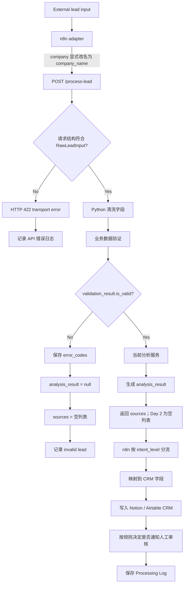

# 当前处理流程

下面的流程反映 Lead Contract V2 在 Day 2 结束时的真实边界。

## 契约要点

- API 只接受 `company_name`；旧字段 `company` 必须由 n8n adapter 显式转换。
- 缺少 `email` 或 `message` 属于 transport error，返回 HTTP 422。
- 空邮箱、错误邮箱或清洗后空白 message 属于 domain invalid，返回 HTTP 200。
- domain invalid 使用 `is_valid=false` 和 `error_codes`，不使用 `error_reason`。
- invalid lead 不进入分析或 RAG，也不伪造默认分析值。
- `external_lead_id` 用于追踪外部来源，但当前没有数据库唯一约束，不能声称已经幂等。
- 当前分析字段仍是过渡契约；Day 3 将实现 `LeadFeatures → PolicyV1 → LeadDecision`。
